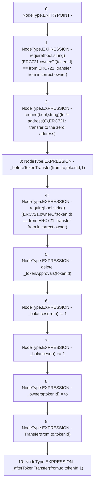

# Context: BasePoolV2._transfer

**Contract:** `BasePoolV2` (Inherits: ReentrancyGuard, ERC721, IERC721Metadata, IERC721, ERC165, IERC165, Context, GasThrottle, ProtocolConstants, IBasePoolV2)
**Signature:** `_transfer(address,address,uint256)`
**Method Selector ID:** `Internal (No Method ID)`
**Visibility:** `internal`
**Environment-Free:** `Yes`
**Modifiers:** None

### State Variables Interaction
- **Reads:** _balances, _tokenApprovals
- **Writes:** _balances, _owners, _tokenApprovals

### Assertion Checks & Business Requirements
- require/assert: `require(bool,string)(ERC721.ownerOf(tokenId) == from,ERC721: transfer from incorrect owner)`
- require/assert: `require(bool,string)(to != address(0),ERC721: transfer to the zero address)`
- require/assert: `require(bool,string)(ERC721.ownerOf(tokenId) == from,ERC721: transfer from incorrect owner)`

### Environment & Verification Flags
- **Uses Foundry Cheatcodes:** No
- **Has Echidna Properties:** No

### Internal Calls Tree
- None

### External Calls / Value Transfers
- `TMP_506(None) = SOLIDITY_CALL require(bool,string)(TMP_505,ERC721: transfer to the zero address)`
- `TMP_503(None) = SOLIDITY_CALL require(bool,string)(TMP_502,ERC721: transfer from incorrect owner)`
- `TMP_510(None) = SOLIDITY_CALL require(bool,string)(TMP_509,ERC721: transfer from incorrect owner)`

### Control Flow Graph (CFG)


### Source Mapping
Declared in: `certora-ac-datasets/detasets/web3bugs/dataset/web3bugs/52/node_modules/@openzeppelin/contracts/token/ERC721/ERC721.sol` on lines **333** to **359**

```solidity
    function _transfer(address from, address to, uint256 tokenId) internal virtual {
        require(ERC721.ownerOf(tokenId) == from, "ERC721: transfer from incorrect owner");
        require(to != address(0), "ERC721: transfer to the zero address");

        _beforeTokenTransfer(from, to, tokenId, 1);

        // Check that tokenId was not transferred by `_beforeTokenTransfer` hook
        require(ERC721.ownerOf(tokenId) == from, "ERC721: transfer from incorrect owner");

        // Clear approvals from the previous owner
        delete _tokenApprovals[tokenId];

        unchecked {
            // `_balances[from]` cannot overflow for the same reason as described in `_burn`:
            // `from`'s balance is the number of token held, which is at least one before the current
            // transfer.
            // `_balances[to]` could overflow in the conditions described in `_mint`. That would require
            // all 2**256 token ids to be minted, which in practice is impossible.
            _balances[from] -= 1;
            _balances[to] += 1;
        }
        _owners[tokenId] = to;

        emit Transfer(from, to, tokenId);

        _afterTokenTransfer(from, to, tokenId, 1);
    }

```
