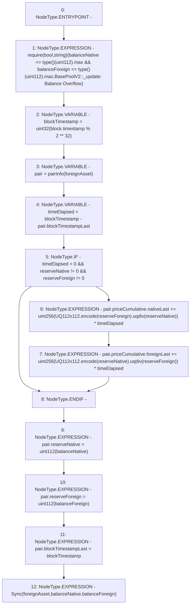

# Context: BasePoolV2._update

**Contract:** `BasePoolV2` (Inherits: ReentrancyGuard, ERC721, IERC721Metadata, IERC721, ERC165, IERC165, Context, GasThrottle, ProtocolConstants, IBasePoolV2)
**Signature:** `_update(IERC20,uint256,uint256,uint112,uint112)`
**Method Selector ID:** `Internal (No Method ID)`
**Visibility:** `internal`
**Environment-Free:** `No (reads EVM state context)`
**Modifiers:** None

### State Variables Interaction
- **Reads:** pairInfo
- **Writes:** pairInfo

### Assertion Checks & Business Requirements
- require/assert: `require(bool,string)(balanceNative <= type()(uint112).max && balanceForeign <= type()(uint112).max,BasePoolV2::_update: Balance Overflow)`

### Environment & Verification Flags
- **Uses Foundry Cheatcodes:** No
- **Has Echidna Properties:** No

### Internal Calls Tree
- None

### External Calls / Value Transfers
- `UQ112x112.TMP_672(uint224) = LIBRARY_CALL, dest:UQ112x112, function:UQ112x112.uqdiv(uint224,uint112), arguments:['TMP_671', 'reserveForeign'] `
- `UQ112x112.TMP_668(uint224) = LIBRARY_CALL, dest:UQ112x112, function:UQ112x112.uqdiv(uint224,uint112), arguments:['TMP_667', 'reserveNative'] `
- `UQ112x112.TMP_667(uint224) = LIBRARY_CALL, dest:UQ112x112, function:UQ112x112.encode(uint112), arguments:['reserveForeign'] `
- `UQ112x112.TMP_671(uint224) = LIBRARY_CALL, dest:UQ112x112, function:UQ112x112.encode(uint112), arguments:['reserveNative'] `

### Control Flow Graph (CFG)


### Source Mapping
Declared in: `certora-ac-datasets/detasets/web3bugs/dataset/web3bugs/52/contracts/dex-v2/pool/BasePoolV2.sol` on lines **533** to **567**

```solidity
    function _update(
        IERC20 foreignAsset,
        uint256 balanceNative,
        uint256 balanceForeign,
        uint112 reserveNative,
        uint112 reserveForeign
    ) internal {
        require(
            balanceNative <= type(uint112).max &&
                balanceForeign <= type(uint112).max,
            "BasePoolV2::_update: Balance Overflow"
        );
        uint32 blockTimestamp = uint32(block.timestamp % 2**32);
        PairInfo storage pair = pairInfo[foreignAsset];
        unchecked {
            uint32 timeElapsed = blockTimestamp - pair.blockTimestampLast; // overflow is desired
            if (timeElapsed > 0 && reserveNative != 0 && reserveForeign != 0) {
                // * never overflows, and + overflow is desired
                pair.priceCumulative.nativeLast +=
                    uint256(
                        UQ112x112.encode(reserveForeign).uqdiv(reserveNative)
                    ) *
                    timeElapsed;
                pair.priceCumulative.foreignLast +=
                    uint256(
                        UQ112x112.encode(reserveNative).uqdiv(reserveForeign)
                    ) *
                    timeElapsed;
            }
        }
        pair.reserveNative = uint112(balanceNative);
        pair.reserveForeign = uint112(balanceForeign);
        pair.blockTimestampLast = blockTimestamp;
        emit Sync(foreignAsset, balanceNative, balanceForeign);
    }

```
