# Context: BasePoolV2.doubleSwap

**Contract:** `BasePoolV2` (Inherits: ReentrancyGuard, ERC721, IERC721Metadata, IERC721, ERC165, IERC165, Context, GasThrottle, ProtocolConstants, IBasePoolV2)
**Signature:** `doubleSwap(IERC20,IERC20,uint256,address) returns (uint256)`
**Method Selector ID:** `0x3981262c`
**Visibility:** `external`
**Environment-Free:** `No (reads EVM state context)`
**Modifiers:**
- `onlyRouter`
  ```solidity
  modifier onlyRouter() {
          _onlyRouter();
          _;
      }
  ```
- `supportedToken`
  ```solidity
  modifier supportedToken(IERC20 token) {
          _supportedToken(token);
          _;
      }
  ```
- `supportedToken`
  ```solidity
  modifier supportedToken(IERC20 token) {
          _supportedToken(token);
          _;
      }
  ```
- `nonReentrant`
  ```solidity
  modifier nonReentrant() {
          _nonReentrantBefore();
          _;
          _nonReentrantAfter();
      }
  ```
- `validateGas`
  ```solidity
  modifier validateGas() {
          // TODO: Uncomment prior to launch
          // require(
          //     block.basefee <= tx.gasprice &&
          //         tx.gasprice <=
          //         uint256(IAggregator(_FAST_GAS_ORACLE).latestAnswer()),
          //     "GasThrottle::validateGas: Gas Exceeds Thresholds"
          // );
          _;
      }
  ```

### State Variables Interaction
- **Reads:** None
- **Writes:** None

### Assertion Checks & Business Requirements
- require/assert: `require(bool,string)(foreignReserve + foreignAmountIn <= foreignAssetA.balanceOf(address(this)),BasePoolV2::doubleSwap: Insufficient Tokens Provided)`
- require/assert: `require(bool,string)(nativeAmountOut > 0 && nativeAmountOut <= nativeReserve,BasePoolV2::doubleSwap: Swap Impossible)`
- require/assert: `require(bool,string)(foreignAmountOut > 0 && foreignAmountOut <= foreignReserve,BasePoolV2::doubleSwap: Swap Impossible)`

### Environment & Verification Flags
- **Uses Foundry Cheatcodes:** No
- **Has Echidna Properties:** No

### Internal Calls Tree
- None

### External Calls / Value Transfers
- `IERC20.TMP_580(uint256) = HIGH_LEVEL_CALL, dest:foreignAssetA(IERC20), function:balanceOf, arguments:['TMP_579']  `
- `SafeERC20.LIBRARY_CALL, dest:SafeERC20, function:SafeERC20.safeTransfer(IERC20,address,uint256), arguments:['foreignAssetB', 'to', 'foreignAmountOut'] `
- `VaderMath.TMP_583(uint256) = LIBRARY_CALL, dest:VaderMath, function:VaderMath.calculateSwap(uint256,uint256,uint256), arguments:['foreignAmountIn', 'foreignReserve', 'nativeReserve'] `
- `VaderMath.TMP_593(uint256) = LIBRARY_CALL, dest:VaderMath, function:VaderMath.calculateSwap(uint256,uint256,uint256), arguments:['nativeAmountOut', 'nativeReserve', 'foreignReserve'] `

### Control Flow Graph (CFG)

```mermaid
flowchart TD
    Node_0["0: NodeType.ENTRYPOINT - "]
    Node_0 --> Node_15
    Node_1["1: NodeType.VARIABLE - "]
    Node_1 --> Node_2
    Node_2["2: NodeType.VARIABLE - "]
    Node_2 --> Node_3
    Node_3["3: NodeType.EXPRESSION - (nativeReserve,foreignReserve,None) = getReserves(foreignAssetA)"]
    Node_3 --> Node_4
    Node_4["4: NodeType.EXPRESSION - require(bool,string)(foreignReserve + foreignAmountIn <= foreignAssetA.balanceOf(address(this)),BasePoolV2::doubleSwap: Insufficient Tokens Provided)"]
    Node_4 --> Node_5
    Node_5["5: NodeType.VARIABLE - nativeAmountOut = VaderMath.calculateSwap(foreignAmountIn,foreignReserve,nativeReserve)"]
    Node_5 --> Node_6
    Node_6["6: NodeType.EXPRESSION - require(bool,string)(nativeAmountOut > 0 && nativeAmountOut <= nativeReserve,BasePoolV2::doubleSwap: Swap Impossible)"]
    Node_6 --> Node_7
    Node_7["7: NodeType.EXPRESSION - _update(foreignAssetA,nativeReserve - nativeAmountOut,foreignReserve + foreignAmountIn,nativeReserve,foreignReserve)"]
    Node_7 --> Node_8
    Node_8["8: NodeType.EXPRESSION - Swap(foreignAssetA,msg.sender,0,foreignAmountIn,nativeAmountOut,0,address(this))"]
    Node_8 --> Node_9
    Node_9["9: NodeType.EXPRESSION - (nativeReserve,foreignReserve,None) = getReserves(foreignAssetB)"]
    Node_9 --> Node_10
    Node_10["10: NodeType.EXPRESSION - foreignAmountOut = VaderMath.calculateSwap(nativeAmountOut,nativeReserve,foreignReserve)"]
    Node_10 --> Node_11
    Node_11["11: NodeType.EXPRESSION - require(bool,string)(foreignAmountOut > 0 && foreignAmountOut <= foreignReserve,BasePoolV2::doubleSwap: Swap Impossible)"]
    Node_11 --> Node_12
    Node_12["12: NodeType.EXPRESSION - _update(foreignAssetB,nativeReserve + nativeAmountOut,foreignReserve - foreignAmountOut,nativeReserve,foreignReserve)"]
    Node_12 --> Node_13
    Node_13["13: NodeType.EXPRESSION - Swap(foreignAssetB,msg.sender,nativeAmountOut,0,0,foreignAmountOut,to)"]
    Node_13 --> Node_14
    Node_14["14: NodeType.EXPRESSION - foreignAssetB.safeTransfer(to,foreignAmountOut)"]
    Node_14 --> Node_20
    Node_15["15: NodeType.EXPRESSION - onlyRouter()"]
    Node_15 --> Node_16
    Node_16["16: NodeType.EXPRESSION - supportedToken(foreignAssetA)"]
    Node_16 --> Node_17
    Node_17["17: NodeType.EXPRESSION - supportedToken(foreignAssetB)"]
    Node_17 --> Node_18
    Node_18["18: NodeType.EXPRESSION - nonReentrant()"]
    Node_18 --> Node_19
    Node_19["19: NodeType.EXPRESSION - validateGas()"]
    Node_19 --> Node_1
    Node_20["20: NodeType.RETURN - foreignAmountOut"]
```


### Source Mapping
Declared in: `certora-ac-datasets/detasets/web3bugs/dataset/web3bugs/52/contracts/dex-v2/pool/BasePoolV2.sol` on lines **315** to **401**

```solidity
    function doubleSwap(
        IERC20 foreignAssetA,
        IERC20 foreignAssetB,
        uint256 foreignAmountIn,
        address to
    )
        external
        override
        onlyRouter
        supportedToken(foreignAssetA)
        supportedToken(foreignAssetB)
        nonReentrant
        validateGas
        returns (uint256 foreignAmountOut)
    {
        (uint112 nativeReserve, uint112 foreignReserve, ) = getReserves(
            foreignAssetA
        ); // gas savings

        require(
            foreignReserve + foreignAmountIn <=
                foreignAssetA.balanceOf(address(this)),
            "BasePoolV2::doubleSwap: Insufficient Tokens Provided"
        );

        uint256 nativeAmountOut = VaderMath.calculateSwap(
            foreignAmountIn,
            foreignReserve,
            nativeReserve
        );

        require(
            nativeAmountOut > 0 && nativeAmountOut <= nativeReserve,
            "BasePoolV2::doubleSwap: Swap Impossible"
        );

        _update(
            foreignAssetA,
            nativeReserve - nativeAmountOut,
            foreignReserve + foreignAmountIn,
            nativeReserve,
            foreignReserve
        );

        emit Swap(
            foreignAssetA,
            msg.sender,
            0,
            foreignAmountIn,
            nativeAmountOut,
            0,
            address(this)
        );

        (nativeReserve, foreignReserve, ) = getReserves(foreignAssetB); // gas savings

        foreignAmountOut = VaderMath.calculateSwap(
            nativeAmountOut,
            nativeReserve,
            foreignReserve
        );

        require(
            foreignAmountOut > 0 && foreignAmountOut <= foreignReserve,
            "BasePoolV2::doubleSwap: Swap Impossible"
        );

        _update(
            foreignAssetB,
            nativeReserve + nativeAmountOut,
            foreignReserve - foreignAmountOut,
            nativeReserve,
            foreignReserve
        );

        emit Swap(
            foreignAssetB,
            msg.sender,
            nativeAmountOut,
            0,
            0,
            foreignAmountOut,
            to
        );

        foreignAssetB.safeTransfer(to, foreignAmountOut);
    }

```
