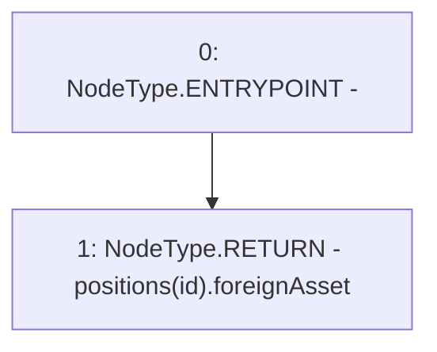

# Context: BasePoolV2.positionForeignAsset

**Contract:** `BasePoolV2` (Inherits: ReentrancyGuard, ERC721, IERC721Metadata, IERC721, ERC165, IERC165, Context, GasThrottle, ProtocolConstants, IBasePoolV2)
**Signature:** `positionForeignAsset(uint256) returns (IERC20)`
**Method Selector ID:** `0xff88bb52`
**Visibility:** `external`
**Environment-Free:** `Yes`
**Modifiers:** None

### State Variables Interaction
- **Reads:** positions
- **Writes:** None

### Environment & Verification Flags
- **Uses Foundry Cheatcodes:** No
- **Has Echidna Properties:** No

### Internal Calls Tree
- None

### External Calls / Value Transfers
- None

### Control Flow Graph (CFG)


### Source Mapping
Declared in: `certora-ac-datasets/detasets/web3bugs/dataset/web3bugs/52/contracts/dex-v2/pool/BasePoolV2.sol` on lines **129** to **136**

```solidity
    function positionForeignAsset(uint256 id)
        external
        view
        override
        returns (IERC20)
    {
        return positions[id].foreignAsset;
    }

```
