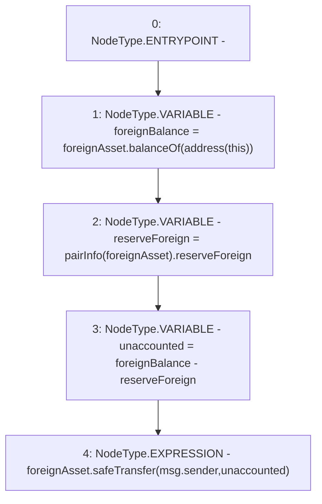

# Context: BasePoolV2.rescue

**Contract:** `BasePoolV2` (Inherits: ReentrancyGuard, ERC721, IERC721Metadata, IERC721, ERC165, IERC165, Context, GasThrottle, ProtocolConstants, IBasePoolV2)
**Signature:** `rescue(IERC20)`
**Method Selector ID:** `0x839006f2`
**Visibility:** `external`
**Environment-Free:** `No (reads EVM state context)`
**Modifiers:** None

### State Variables Interaction
- **Reads:** pairInfo
- **Writes:** None

### Environment & Verification Flags
- **Uses Foundry Cheatcodes:** No
- **Has Echidna Properties:** No

### Internal Calls Tree
- None

### External Calls / Value Transfers
- `SafeERC20.LIBRARY_CALL, dest:SafeERC20, function:SafeERC20.safeTransfer(IERC20,address,uint256), arguments:['foreignAsset', 'msg.sender', 'unaccounted'] `
- `IERC20.TMP_647(uint256) = HIGH_LEVEL_CALL, dest:foreignAsset(IERC20), function:balanceOf, arguments:['TMP_646']  `

### Control Flow Graph (CFG)


### Source Mapping
Declared in: `certora-ac-datasets/detasets/web3bugs/dataset/web3bugs/52/contracts/dex-v2/pool/BasePoolV2.sol` on lines **510** to **517**

```solidity
    function rescue(IERC20 foreignAsset) external {
        uint256 foreignBalance = foreignAsset.balanceOf(address(this));
        uint256 reserveForeign = pairInfo[foreignAsset].reserveForeign;

        uint256 unaccounted = foreignBalance - reserveForeign;

        foreignAsset.safeTransfer(msg.sender, unaccounted);
    }

```
