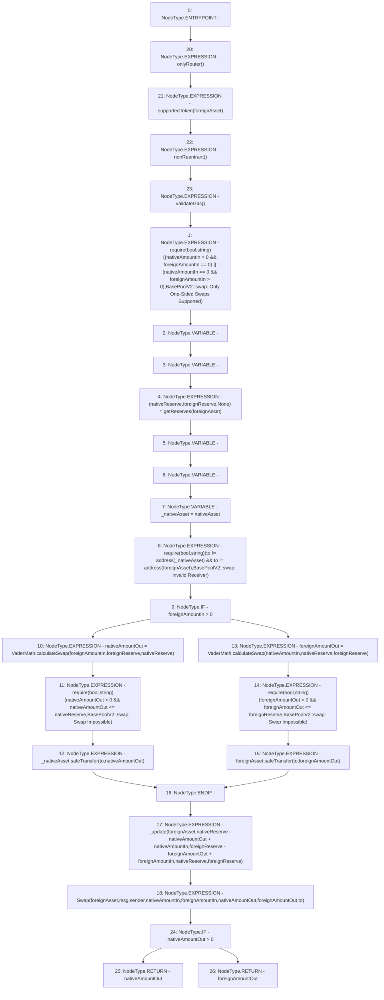

# Context: BasePoolV2.swap

**Contract:** `BasePoolV2` (Inherits: ReentrancyGuard, ERC721, IERC721Metadata, IERC721, ERC165, IERC165, Context, GasThrottle, ProtocolConstants, IBasePoolV2)
**Signature:** `swap(IERC20,uint256,uint256,address) returns (uint256)`
**Method Selector ID:** `0xf3e6ea8a`
**Visibility:** `external`
**Environment-Free:** `No (reads EVM state context)`
**Modifiers:**
- `onlyRouter`
  ```solidity
  modifier onlyRouter() {
          _onlyRouter();
          _;
      }
  ```
- `supportedToken`
  ```solidity
  modifier supportedToken(IERC20 token) {
          _supportedToken(token);
          _;
      }
  ```
- `nonReentrant`
  ```solidity
  modifier nonReentrant() {
          _nonReentrantBefore();
          _;
          _nonReentrantAfter();
      }
  ```
- `validateGas`
  ```solidity
  modifier validateGas() {
          // TODO: Uncomment prior to launch
          // require(
          //     block.basefee <= tx.gasprice &&
          //         tx.gasprice <=
          //         uint256(IAggregator(_FAST_GAS_ORACLE).latestAnswer()),
          //     "GasThrottle::validateGas: Gas Exceeds Thresholds"
          // );
          _;
      }
  ```

### State Variables Interaction
- **Reads:** nativeAsset
- **Writes:** None

### Assertion Checks & Business Requirements
- require/assert: `require(bool,string)((nativeAmountIn > 0 && foreignAmountIn == 0) || (nativeAmountIn == 0 && foreignAmountIn > 0),BasePoolV2::swap: Only One-Sided Swaps Supported)`
- require/assert: `require(bool,string)(to != address(_nativeAsset) && to != address(foreignAsset),BasePoolV2::swap: Invalid Receiver)`
- require/assert: `require(bool,string)(nativeAmountOut > 0 && nativeAmountOut <= nativeReserve,BasePoolV2::swap: Swap Impossible)`
- require/assert: `require(bool,string)(foreignAmountOut > 0 && foreignAmountOut <= foreignReserve,BasePoolV2::swap: Swap Impossible)`

### Environment & Verification Flags
- **Uses Foundry Cheatcodes:** No
- **Has Echidna Properties:** No

### Internal Calls Tree
- None

### External Calls / Value Transfers
- `VaderMath.TMP_623(uint256) = LIBRARY_CALL, dest:VaderMath, function:VaderMath.calculateSwap(uint256,uint256,uint256), arguments:['foreignAmountIn', 'foreignReserve', 'nativeReserve'] `
- `SafeERC20.LIBRARY_CALL, dest:SafeERC20, function:SafeERC20.safeTransfer(IERC20,address,uint256), arguments:['foreignAsset', 'to', 'foreignAmountOut'] `
- `SafeERC20.LIBRARY_CALL, dest:SafeERC20, function:SafeERC20.safeTransfer(IERC20,address,uint256), arguments:['_nativeAsset', 'to', 'nativeAmountOut'] `
- `VaderMath.TMP_629(uint256) = LIBRARY_CALL, dest:VaderMath, function:VaderMath.calculateSwap(uint256,uint256,uint256), arguments:['nativeAmountIn', 'nativeReserve', 'foreignReserve'] `

### Control Flow Graph (CFG)


### Source Mapping
Declared in: `certora-ac-datasets/detasets/web3bugs/dataset/web3bugs/52/contracts/dex-v2/pool/BasePoolV2.sol` on lines **426** to **503**

```solidity
    function swap(
        IERC20 foreignAsset,
        uint256 nativeAmountIn,
        uint256 foreignAmountIn,
        address to
    )
        external
        override
        onlyRouter
        supportedToken(foreignAsset)
        nonReentrant
        validateGas
        returns (uint256)
    {
        require(
            (nativeAmountIn > 0 && foreignAmountIn == 0) ||
                (nativeAmountIn == 0 && foreignAmountIn > 0),
            "BasePoolV2::swap: Only One-Sided Swaps Supported"
        );
        (uint112 nativeReserve, uint112 foreignReserve, ) = getReserves(
            foreignAsset
        ); // gas savings

        uint256 nativeAmountOut;
        uint256 foreignAmountOut;
        {
            // scope for _token{0,1}, avoids stack too deep errors
            IERC20 _nativeAsset = nativeAsset;
            require(
                to != address(_nativeAsset) && to != address(foreignAsset),
                "BasePoolV2::swap: Invalid Receiver"
            );

            if (foreignAmountIn > 0) {
                nativeAmountOut = VaderMath.calculateSwap(
                    foreignAmountIn,
                    foreignReserve,
                    nativeReserve
                );
                require(
                    nativeAmountOut > 0 && nativeAmountOut <= nativeReserve,
                    "BasePoolV2::swap: Swap Impossible"
                );
                _nativeAsset.safeTransfer(to, nativeAmountOut); // optimistically transfer tokens
            } else {
                foreignAmountOut = VaderMath.calculateSwap(
                    nativeAmountIn,
                    nativeReserve,
                    foreignReserve
                );
                require(
                    foreignAmountOut > 0 && foreignAmountOut <= foreignReserve,
                    "BasePoolV2::swap: Swap Impossible"
                );
                foreignAsset.safeTransfer(to, foreignAmountOut); // optimistically transfer tokens
            }
        }

        _update(
            foreignAsset,
            nativeReserve - nativeAmountOut + nativeAmountIn,
            foreignReserve - foreignAmountOut + foreignAmountIn,
            nativeReserve,
            foreignReserve
        );

        emit Swap(
            foreignAsset,
            msg.sender,
            nativeAmountIn,
            foreignAmountIn,
            nativeAmountOut,
            foreignAmountOut,
            to
        );

        return nativeAmountOut > 0 ? nativeAmountOut : foreignAmountOut;
    }

```
