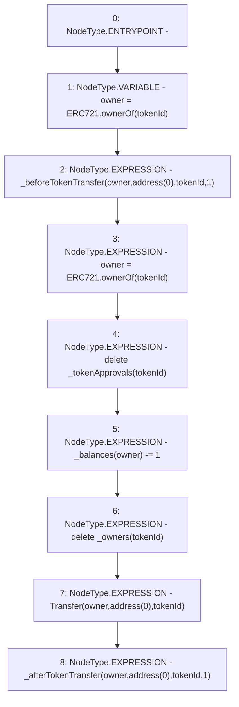

# Context: BasePool._burn

**Contract:** `BasePool` (Inherits: ReentrancyGuard, Ownable, ERC721, IERC721Metadata, IERC721, ERC165, IERC165, Context, GasThrottle, ProtocolConstants, IBasePool)
**Signature:** `_burn(uint256)`
**Method Selector ID:** `Internal (No Method ID)`
**Visibility:** `internal`
**Environment-Free:** `Yes`
**Modifiers:** None

### State Variables Interaction
- **Reads:** _balances, _owners, _tokenApprovals
- **Writes:** _balances, _owners, _tokenApprovals

### Environment & Verification Flags
- **Uses Foundry Cheatcodes:** No
- **Has Echidna Properties:** No

### Internal Calls Tree
- None

### External Calls / Value Transfers
- None

### Control Flow Graph (CFG)


### Source Mapping
Declared in: `certora-ac-datasets/detasets/web3bugs/dataset/web3bugs/52/node_modules/@openzeppelin/contracts/token/ERC721/ERC721.sol` on lines **299** to **320**

```solidity
    function _burn(uint256 tokenId) internal virtual {
        address owner = ERC721.ownerOf(tokenId);

        _beforeTokenTransfer(owner, address(0), tokenId, 1);

        // Update ownership in case tokenId was transferred by `_beforeTokenTransfer` hook
        owner = ERC721.ownerOf(tokenId);

        // Clear approvals
        delete _tokenApprovals[tokenId];

        unchecked {
            // Cannot overflow, as that would require more tokens to be burned/transferred
            // out than the owner initially received through minting and transferring in.
            _balances[owner] -= 1;
        }
        delete _owners[tokenId];

        emit Transfer(owner, address(0), tokenId);

        _afterTokenTransfer(owner, address(0), tokenId, 1);
    }

```
