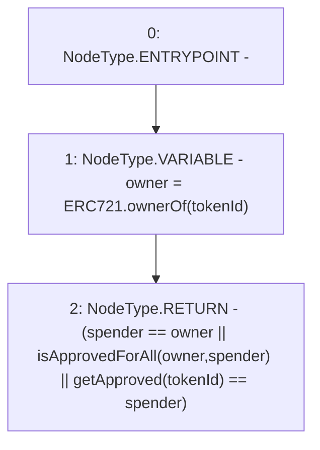

# Context: BasePool._isApprovedOrOwner

**Contract:** `BasePool` (Inherits: ReentrancyGuard, Ownable, ERC721, IERC721Metadata, IERC721, ERC165, IERC165, Context, GasThrottle, ProtocolConstants, IBasePool)
**Signature:** `_isApprovedOrOwner(address,uint256) returns (bool)`
**Method Selector ID:** `Internal (No Method ID)`
**Visibility:** `internal`
**Environment-Free:** `Yes`
**Modifiers:** None

### State Variables Interaction
- **Reads:** None
- **Writes:** None

### Environment & Verification Flags
- **Uses Foundry Cheatcodes:** No
- **Has Echidna Properties:** No

### Internal Calls Tree
- None

### External Calls / Value Transfers
- None

### Control Flow Graph (CFG)


### Source Mapping
Declared in: `certora-ac-datasets/detasets/web3bugs/dataset/web3bugs/52/node_modules/@openzeppelin/contracts/token/ERC721/ERC721.sol` on lines **221** to **224**

```solidity
    function _isApprovedOrOwner(address spender, uint256 tokenId) internal view virtual returns (bool) {
        address owner = ERC721.ownerOf(tokenId);
        return (spender == owner || isApprovedForAll(owner, spender) || getApproved(tokenId) == spender);
    }

```
