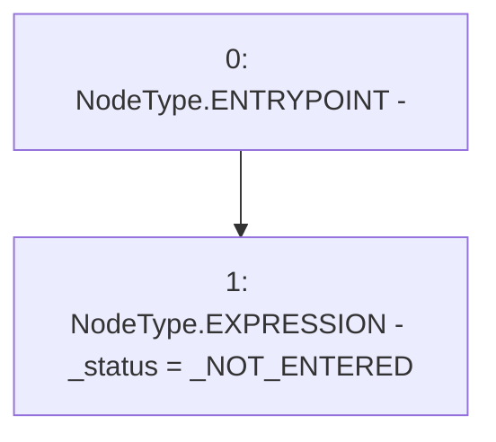

# Context: BasePool._nonReentrantAfter

**Contract:** `BasePool` (Inherits: ReentrancyGuard, Ownable, ERC721, IERC721Metadata, IERC721, ERC165, IERC165, Context, GasThrottle, ProtocolConstants, IBasePool)
**Signature:** `_nonReentrantAfter()`
**Method Selector ID:** `Internal (No Method ID)`
**Visibility:** `private`
**Environment-Free:** `Yes`
**Modifiers:** None

### State Variables Interaction
- **Reads:** _NOT_ENTERED
- **Writes:** _status

### Environment & Verification Flags
- **Uses Foundry Cheatcodes:** No
- **Has Echidna Properties:** No

### Internal Calls Tree
- None

### External Calls / Value Transfers
- None

### Control Flow Graph (CFG)


### Source Mapping
Declared in: `certora-ac-datasets/detasets/web3bugs/dataset/web3bugs/52/node_modules/@openzeppelin/contracts/security/ReentrancyGuard.sol` on lines **64** to **68**

```solidity
    function _nonReentrantAfter() private {
        // By storing the original value once again, a refund is triggered (see
        // https://eips.ethereum.org/EIPS/eip-2200)
        _status = _NOT_ENTERED;
    }

```
