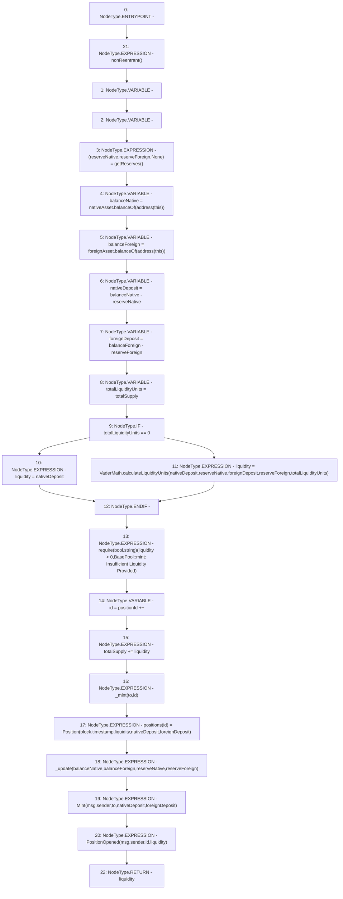

# Context: BasePool.mint

**Contract:** `BasePool` (Inherits: ReentrancyGuard, Ownable, ERC721, IERC721Metadata, IERC721, ERC165, IERC165, Context, GasThrottle, ProtocolConstants, IBasePool)
**Signature:** `mint(address) returns (uint256)`
**Method Selector ID:** `0x6a627842`
**Visibility:** `external`
**Environment-Free:** `No (reads EVM state context)`
**Modifiers:**
- `nonReentrant`
  ```solidity
  modifier nonReentrant() {
          _nonReentrantBefore();
          _;
          _nonReentrantAfter();
      }
  ```

### State Variables Interaction
- **Reads:** foreignAsset, nativeAsset, positionId, totalSupply
- **Writes:** positionId, positions, totalSupply

### Assertion Checks & Business Requirements
- require/assert: `require(bool,string)(liquidity > 0,BasePool::mint: Insufficient Liquidity Provided)`

### Environment & Verification Flags
- **Uses Foundry Cheatcodes:** No
- **Has Echidna Properties:** No

### Internal Calls Tree
- None

### External Calls / Value Transfers
- `IERC20.TMP_627(uint256) = HIGH_LEVEL_CALL, dest:nativeAsset(IERC20), function:balanceOf, arguments:['TMP_626']  `
- `VaderMath.TMP_633(uint256) = LIBRARY_CALL, dest:VaderMath, function:VaderMath.calculateLiquidityUnits(uint256,uint256,uint256,uint256,uint256), arguments:['nativeDeposit', 'reserveNative', 'foreignDeposit', 'reserveForeign', 'totalLiquidityUnits'] `
- `IERC20.TMP_629(uint256) = HIGH_LEVEL_CALL, dest:foreignAsset(IERC20), function:balanceOf, arguments:['TMP_628']  `

### Control Flow Graph (CFG)


### Source Mapping
Declared in: `certora-ac-datasets/detasets/web3bugs/dataset/web3bugs/52/contracts/dex/pool/BasePool.sol` on lines **149** to **194**

```solidity
    function mint(address to)
        external
        override
        nonReentrant
        returns (uint256 liquidity)
    {
        (uint112 reserveNative, uint112 reserveForeign, ) = getReserves(); // gas savings
        uint256 balanceNative = nativeAsset.balanceOf(address(this));
        uint256 balanceForeign = foreignAsset.balanceOf(address(this));
        uint256 nativeDeposit = balanceNative - reserveNative;
        uint256 foreignDeposit = balanceForeign - reserveForeign;

        uint256 totalLiquidityUnits = totalSupply;
        if (totalLiquidityUnits == 0)
            liquidity = nativeDeposit; // TODO: Contact ThorChain on proper approach
        else
            liquidity = VaderMath.calculateLiquidityUnits(
                nativeDeposit,
                reserveNative,
                foreignDeposit,
                reserveForeign,
                totalLiquidityUnits
            );

        require(
            liquidity > 0,
            "BasePool::mint: Insufficient Liquidity Provided"
        );

        uint256 id = positionId++;

        totalSupply += liquidity;
        _mint(to, id);

        positions[id] = Position(
            block.timestamp,
            liquidity,
            nativeDeposit,
            foreignDeposit
        );

        _update(balanceNative, balanceForeign, reserveNative, reserveForeign);

        emit Mint(msg.sender, to, nativeDeposit, foreignDeposit);
        emit PositionOpened(msg.sender, id, liquidity);
    }

```
