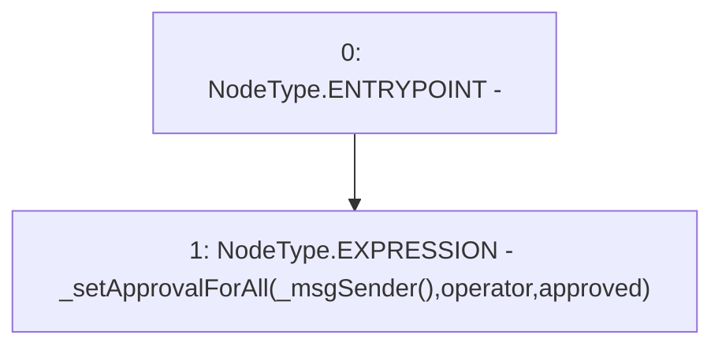

# Context: BasePool.setApprovalForAll

**Contract:** `BasePool` (Inherits: ReentrancyGuard, Ownable, ERC721, IERC721Metadata, IERC721, ERC165, IERC165, Context, GasThrottle, ProtocolConstants, IBasePool)
**Signature:** `setApprovalForAll(address,bool)`
**Method Selector ID:** `0xa22cb465`
**Visibility:** `public`
**Environment-Free:** `No (reads EVM state context)`
**Modifiers:** None

### State Variables Interaction
- **Reads:** None
- **Writes:** None

### Environment & Verification Flags
- **Uses Foundry Cheatcodes:** No
- **Has Echidna Properties:** No

### Internal Calls Tree
- None

### External Calls / Value Transfers
- None

### Control Flow Graph (CFG)


### Source Mapping
Declared in: `certora-ac-datasets/detasets/web3bugs/dataset/web3bugs/52/node_modules/@openzeppelin/contracts/token/ERC721/ERC721.sol` on lines **136** to **138**

```solidity
    function setApprovalForAll(address operator, bool approved) public virtual override {
        _setApprovalForAll(_msgSender(), operator, approved);
    }

```
