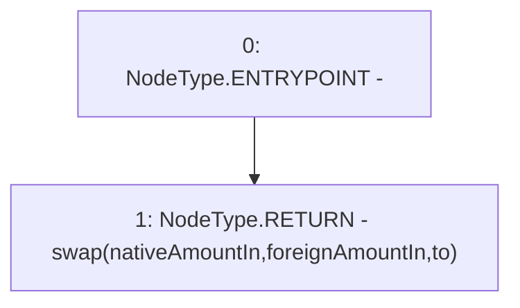

# Context: BasePool.swap

**Contract:** `BasePool` (Inherits: ReentrancyGuard, Ownable, ERC721, IERC721Metadata, IERC721, ERC165, IERC165, Context, GasThrottle, ProtocolConstants, IBasePool)
**Signature:** `swap(uint256,uint256,address,bytes) returns (uint256)`
**Method Selector ID:** `0x022c0d9f`
**Visibility:** `external`
**Environment-Free:** `No (reads EVM state context)`
**Modifiers:** None

### State Variables Interaction
- **Reads:** None
- **Writes:** None

### Environment & Verification Flags
- **Uses Foundry Cheatcodes:** No
- **Has Echidna Properties:** No

### Internal Calls Tree
- None

### External Calls / Value Transfers
- None

### Control Flow Graph (CFG)


### Source Mapping
Declared in: `certora-ac-datasets/detasets/web3bugs/dataset/web3bugs/52/contracts/dex/pool/BasePool.sol` on lines **261** to **268**

```solidity
    function swap(
        uint256 nativeAmountIn,
        uint256 foreignAmountIn,
        address to,
        bytes calldata
    ) external override returns (uint256) {
        return swap(nativeAmountIn, foreignAmountIn, to);
    }

```
