# Context: BitMath.leastSignificantBit

**Contract:** `BitMath` (Inherits: None)
**Signature:** `leastSignificantBit(uint256) returns (uint8)`
**Method Selector ID:** `Internal (No Method ID)`
**Visibility:** `internal`
**Environment-Free:** `Yes`
**Modifiers:** None

### State Variables Interaction
- **Reads:** None
- **Writes:** None

### Assertion Checks & Business Requirements
- require/assert: `require(bool,string)(x > 0,BitMath::leastSignificantBit: zero)`

### Environment & Verification Flags
- **Uses Foundry Cheatcodes:** No
- **Has Echidna Properties:** No

### Internal Calls Tree
- None

### External Calls / Value Transfers
- None

### Control Flow Graph (CFG)

```mermaid
flowchart TD
    Node_0["0: NodeType.ENTRYPOINT - "]
    Node_0 --> Node_1
    Node_1["1: NodeType.EXPRESSION - require(bool,string)(x > 0,BitMath::leastSignificantBit: zero)"]
    Node_1 --> Node_2
    Node_2["2: NodeType.EXPRESSION - r = 255"]
    Node_2 --> Node_3
    Node_3["3: NodeType.IF - x & type()(uint128).max > 0"]
    Node_3 --> Node_4
    Node_3 --> Node_5
    Node_4["4: NodeType.EXPRESSION - r -= 128"]
    Node_4 --> Node_6
    Node_5["5: NodeType.EXPRESSION - x >>= 128"]
    Node_5 --> Node_6
    Node_6["6: NodeType.ENDIF - "]
    Node_6 --> Node_7
    Node_7["7: NodeType.IF - x & type()(uint64).max > 0"]
    Node_7 --> Node_8
    Node_7 --> Node_9
    Node_8["8: NodeType.EXPRESSION - r -= 64"]
    Node_8 --> Node_10
    Node_9["9: NodeType.EXPRESSION - x >>= 64"]
    Node_9 --> Node_10
    Node_10["10: NodeType.ENDIF - "]
    Node_10 --> Node_11
    Node_11["11: NodeType.IF - x & type()(uint32).max > 0"]
    Node_11 --> Node_12
    Node_11 --> Node_13
    Node_12["12: NodeType.EXPRESSION - r -= 32"]
    Node_12 --> Node_14
    Node_13["13: NodeType.EXPRESSION - x >>= 32"]
    Node_13 --> Node_14
    Node_14["14: NodeType.ENDIF - "]
    Node_14 --> Node_15
    Node_15["15: NodeType.IF - x & type()(uint16).max > 0"]
    Node_15 --> Node_16
    Node_15 --> Node_17
    Node_16["16: NodeType.EXPRESSION - r -= 16"]
    Node_16 --> Node_18
    Node_17["17: NodeType.EXPRESSION - x >>= 16"]
    Node_17 --> Node_18
    Node_18["18: NodeType.ENDIF - "]
    Node_18 --> Node_19
    Node_19["19: NodeType.IF - x & type()(uint8).max > 0"]
    Node_19 --> Node_20
    Node_19 --> Node_21
    Node_20["20: NodeType.EXPRESSION - r -= 8"]
    Node_20 --> Node_22
    Node_21["21: NodeType.EXPRESSION - x >>= 8"]
    Node_21 --> Node_22
    Node_22["22: NodeType.ENDIF - "]
    Node_22 --> Node_23
    Node_23["23: NodeType.IF - x & 0xf > 0"]
    Node_23 --> Node_24
    Node_23 --> Node_25
    Node_24["24: NodeType.EXPRESSION - r -= 4"]
    Node_24 --> Node_26
    Node_25["25: NodeType.EXPRESSION - x >>= 4"]
    Node_25 --> Node_26
    Node_26["26: NodeType.ENDIF - "]
    Node_26 --> Node_27
    Node_27["27: NodeType.IF - x & 0x3 > 0"]
    Node_27 --> Node_28
    Node_27 --> Node_29
    Node_28["28: NodeType.EXPRESSION - r -= 2"]
    Node_28 --> Node_30
    Node_29["29: NodeType.EXPRESSION - x >>= 2"]
    Node_29 --> Node_30
    Node_30["30: NodeType.ENDIF - "]
    Node_30 --> Node_31
    Node_31["31: NodeType.IF - x & 0x1 > 0"]
    Node_31 --> Node_32
    Node_31 --> Node_33
    Node_32["32: NodeType.EXPRESSION - r -= 1"]
    Node_32 --> Node_33
    Node_33["33: NodeType.ENDIF - "]
    Node_33 --> Node_34
    Node_34["34: NodeType.RETURN - r"]
```


### Source Mapping
Declared in: `certora-ac-datasets/detasets/web3bugs/dataset/web3bugs/52/contracts/external/libraries/BitMath.sol` on lines **44** to **84**

```solidity
    function leastSignificantBit(uint256 x) internal pure returns (uint8 r) {
        require(x > 0, "BitMath::leastSignificantBit: zero");

        r = 255;
        if (x & type(uint128).max > 0) {
            r -= 128;
        } else {
            x >>= 128;
        }
        if (x & type(uint64).max > 0) {
            r -= 64;
        } else {
            x >>= 64;
        }
        if (x & type(uint32).max > 0) {
            r -= 32;
        } else {
            x >>= 32;
        }
        if (x & type(uint16).max > 0) {
            r -= 16;
        } else {
            x >>= 16;
        }
        if (x & type(uint8).max > 0) {
            r -= 8;
        } else {
            x >>= 8;
        }
        if (x & 0xf > 0) {
            r -= 4;
        } else {
            x >>= 4;
        }
        if (x & 0x3 > 0) {
            r -= 2;
        } else {
            x >>= 2;
        }
        if (x & 0x1 > 0) r -= 1;
    }

```
