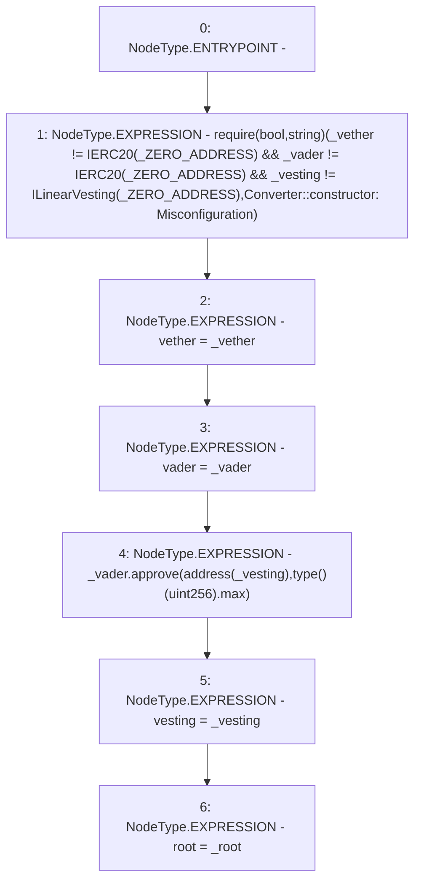

# Context: Converter.constructor

**Contract:** `Converter` (Inherits: ProtocolConstants, IConverter)
**Signature:** `constructor(IERC20,IERC20,ILinearVesting,bytes32)`
**Method Selector ID:** `0x45aea35c`
**Visibility:** `public`
**Environment-Free:** `Yes`
**Modifiers:** None

### State Variables Interaction
- **Reads:** _ZERO_ADDRESS
- **Writes:** root, vader, vesting, vether

### Assertion Checks & Business Requirements
- require/assert: `require(bool,string)(_vether != IERC20(_ZERO_ADDRESS) && _vader != IERC20(_ZERO_ADDRESS) && _vesting != ILinearVesting(_ZERO_ADDRESS),Converter::constructor: Misconfiguration)`

### Environment & Verification Flags
- **Uses Foundry Cheatcodes:** No
- **Has Echidna Properties:** No

### Internal Calls Tree
- None

### External Calls / Value Transfers
- `IERC20.TMP_159(bool) = HIGH_LEVEL_CALL, dest:_vader(IERC20), function:approve, arguments:['TMP_156', 'TMP_158']  `

### Control Flow Graph (CFG)


### Source Mapping
Declared in: `certora-ac-datasets/detasets/web3bugs/dataset/web3bugs/52/contracts/tokens/converter/Converter.sol` on lines **62** to **82**

```solidity
    constructor(
        IERC20 _vether,
        IERC20 _vader,
        ILinearVesting _vesting,
        bytes32 _root
    ) {
        require(
            _vether != IERC20(_ZERO_ADDRESS) &&
                _vader != IERC20(_ZERO_ADDRESS) &&
                _vesting != ILinearVesting(_ZERO_ADDRESS),
            "Converter::constructor: Misconfiguration"
        );

        vether = _vether;
        vader = _vader;

        _vader.approve(address(_vesting), type(uint256).max);

        vesting = _vesting;
        root = _root;
    }

```
