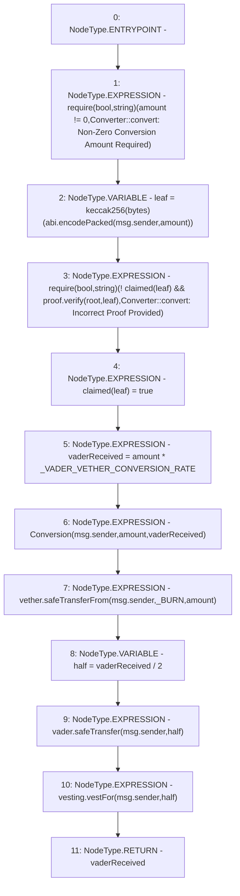

# Context: Converter.convert

**Contract:** `Converter` (Inherits: ProtocolConstants, IConverter)
**Signature:** `convert(bytes32[],uint256) returns (uint256)`
**Method Selector ID:** `0x416d7632`
**Visibility:** `external`
**Environment-Free:** `No (reads EVM state context)`
**Modifiers:** None

### State Variables Interaction
- **Reads:** _BURN, _VADER_VETHER_CONVERSION_RATE, claimed, root, vader, vesting, vether
- **Writes:** claimed

### Assertion Checks & Business Requirements
- require/assert: `require(bool,string)(amount != 0,Converter::convert: Non-Zero Conversion Amount Required)`
- require/assert: `require(bool,string)(! claimed[leaf] && proof.verify(root,leaf),Converter::convert: Incorrect Proof Provided)`

### Environment & Verification Flags
- **Uses Foundry Cheatcodes:** No
- **Has Echidna Properties:** No

### Internal Calls Tree
- None

### External Calls / Value Transfers
- `ILinearVesting.HIGH_LEVEL_CALL, dest:vesting(ILinearVesting), function:vestFor, arguments:['msg.sender', 'half']  `
- `MerkleProof.TMP_165(bool) = LIBRARY_CALL, dest:MerkleProof, function:MerkleProof.verify(bytes32[],bytes32,bytes32), arguments:['proof', 'root', 'leaf'] `
- `SafeERC20.LIBRARY_CALL, dest:SafeERC20, function:SafeERC20.safeTransfer(IERC20,address,uint256), arguments:['vader', 'msg.sender', 'half'] `
- `SafeERC20.LIBRARY_CALL, dest:SafeERC20, function:SafeERC20.safeTransferFrom(IERC20,address,address,uint256), arguments:['vether', 'msg.sender', '_BURN', 'amount'] `
- `TMP_162(bytes) = SOLIDITY_CALL abi.encodePacked()(msg.sender,amount)`

### Control Flow Graph (CFG)


### Source Mapping
Declared in: `certora-ac-datasets/detasets/web3bugs/dataset/web3bugs/52/contracts/tokens/converter/Converter.sol` on lines **101** to **126**

```solidity
    function convert(bytes32[] calldata proof, uint256 amount)
        external
        override
        returns (uint256 vaderReceived)
    {
        require(
            amount != 0,
            "Converter::convert: Non-Zero Conversion Amount Required"
        );

        bytes32 leaf = keccak256(abi.encodePacked(msg.sender, amount));
        require(
            !claimed[leaf] && proof.verify(root, leaf),
            "Converter::convert: Incorrect Proof Provided"
        );
        claimed[leaf] = true;

        vaderReceived = amount * _VADER_VETHER_CONVERSION_RATE;

        emit Conversion(msg.sender, amount, vaderReceived);

        vether.safeTransferFrom(msg.sender, _BURN, amount);
        uint256 half = vaderReceived / 2;
        vader.safeTransfer(msg.sender, half);
        vesting.vestFor(msg.sender, half);
    }

```
