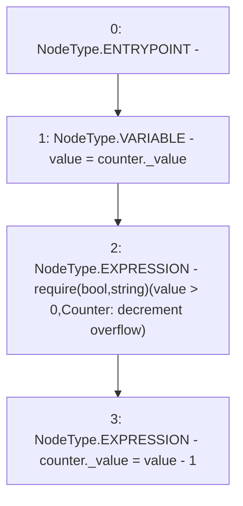

# Context: Counters.decrement

**Contract:** `Counters` (Inherits: None)
**Signature:** `decrement(Counters.Counter)`
**Method Selector ID:** `Internal (No Method ID)`
**Visibility:** `internal`
**Environment-Free:** `Yes`
**Modifiers:** None

### State Variables Interaction
- **Reads:** None
- **Writes:** None

### Assertion Checks & Business Requirements
- require/assert: `require(bool,string)(value > 0,Counter: decrement overflow)`

### Environment & Verification Flags
- **Uses Foundry Cheatcodes:** No
- **Has Echidna Properties:** No

### Internal Calls Tree
- None

### External Calls / Value Transfers
- None

### Control Flow Graph (CFG)


### Source Mapping
Declared in: `certora-ac-datasets/detasets/web3bugs/dataset/web3bugs/52/node_modules/@openzeppelin/contracts/utils/Counters.sol` on lines **32** to **38**

```solidity
    function decrement(Counter storage counter) internal {
        uint256 value = counter._value;
        require(value > 0, "Counter: decrement overflow");
        unchecked {
            counter._value = value - 1;
        }
    }

```
