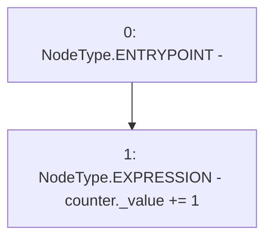

# Context: Counters.increment

**Contract:** `Counters` (Inherits: None)
**Signature:** `increment(Counters.Counter)`
**Method Selector ID:** `Internal (No Method ID)`
**Visibility:** `internal`
**Environment-Free:** `Yes`
**Modifiers:** None

### State Variables Interaction
- **Reads:** None
- **Writes:** None

### Environment & Verification Flags
- **Uses Foundry Cheatcodes:** No
- **Has Echidna Properties:** No

### Internal Calls Tree
- None

### External Calls / Value Transfers
- None

### Control Flow Graph (CFG)


### Source Mapping
Declared in: `certora-ac-datasets/detasets/web3bugs/dataset/web3bugs/52/node_modules/@openzeppelin/contracts/utils/Counters.sol` on lines **26** to **30**

```solidity
    function increment(Counter storage counter) internal {
        unchecked {
            counter._value += 1;
        }
    }

```
