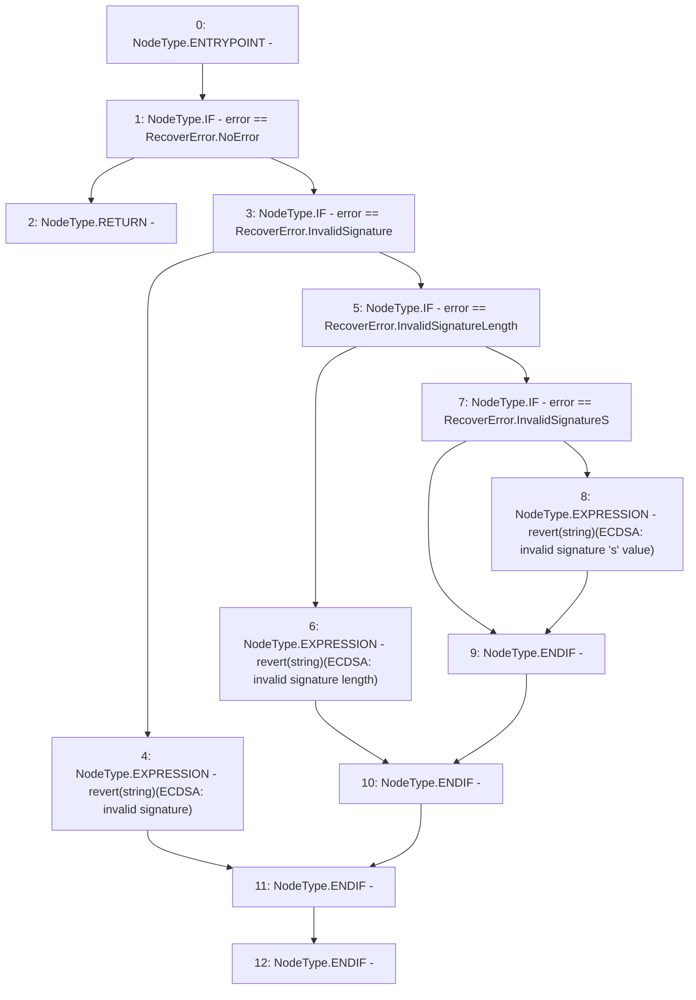

# Context: ECDSA._throwError

**Contract:** `ECDSA` (Inherits: None)
**Signature:** `_throwError(ECDSA.RecoverError)`
**Method Selector ID:** `Internal (No Method ID)`
**Visibility:** `private`
**Environment-Free:** `Yes`
**Modifiers:** None

### State Variables Interaction
- **Reads:** None
- **Writes:** None

### Assertion Checks & Business Requirements
- revert: `revert(string)(ECDSA: invalid signature)`
- revert: `revert(string)(ECDSA: invalid signature length)`
- revert: `revert(string)(ECDSA: invalid signature 's' value)`

### Environment & Verification Flags
- **Uses Foundry Cheatcodes:** No
- **Has Echidna Properties:** No

### Internal Calls Tree
- None

### External Calls / Value Transfers
- None

### Control Flow Graph (CFG)


### Source Mapping
Declared in: `certora-ac-datasets/detasets/web3bugs/dataset/web3bugs/52/node_modules/@openzeppelin/contracts/utils/cryptography/ECDSA.sol` on lines **23** to **33**

```solidity
    function _throwError(RecoverError error) private pure {
        if (error == RecoverError.NoError) {
            return; // no error: do nothing
        } else if (error == RecoverError.InvalidSignature) {
            revert("ECDSA: invalid signature");
        } else if (error == RecoverError.InvalidSignatureLength) {
            revert("ECDSA: invalid signature length");
        } else if (error == RecoverError.InvalidSignatureS) {
            revert("ECDSA: invalid signature 's' value");
        }
    }

```
