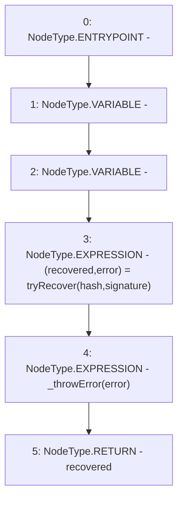

# Context: ECDSA.recover

**Contract:** `ECDSA` (Inherits: None)
**Signature:** `recover(bytes32,bytes) returns (address)`
**Method Selector ID:** `Internal (No Method ID)`
**Visibility:** `internal`
**Environment-Free:** `Yes`
**Modifiers:** None

### State Variables Interaction
- **Reads:** None
- **Writes:** None

### Environment & Verification Flags
- **Uses Foundry Cheatcodes:** No
- **Has Echidna Properties:** No

### Internal Calls Tree
- None

### External Calls / Value Transfers
- None

### Control Flow Graph (CFG)


### Source Mapping
Declared in: `certora-ac-datasets/detasets/web3bugs/dataset/web3bugs/52/node_modules/@openzeppelin/contracts/utils/cryptography/ECDSA.sol` on lines **88** to **92**

```solidity
    function recover(bytes32 hash, bytes memory signature) internal pure returns (address) {
        (address recovered, RecoverError error) = tryRecover(hash, signature);
        _throwError(error);
        return recovered;
    }

```
