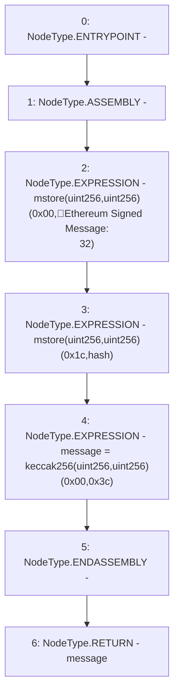

# Context: ECDSA.toEthSignedMessageHash

**Contract:** `ECDSA` (Inherits: None)
**Signature:** `toEthSignedMessageHash(bytes32) returns (bytes32)`
**Method Selector ID:** `Internal (No Method ID)`
**Visibility:** `internal`
**Environment-Free:** `Yes`
**Modifiers:** None

### State Variables Interaction
- **Reads:** None
- **Writes:** None

### Environment & Verification Flags
- **Uses Foundry Cheatcodes:** No
- **Has Echidna Properties:** No

### Internal Calls Tree
- None

### External Calls / Value Transfers
- None

### Control Flow Graph (CFG)


### Source Mapping
Declared in: `certora-ac-datasets/detasets/web3bugs/dataset/web3bugs/52/node_modules/@openzeppelin/contracts/utils/cryptography/ECDSA.sol` on lines **165** to **174**

```solidity
    function toEthSignedMessageHash(bytes32 hash) internal pure returns (bytes32 message) {
        // 32 is the length in bytes of hash,
        // enforced by the type signature above
        /// @solidity memory-safe-assembly
        assembly {
            mstore(0x00, "\x19Ethereum Signed Message:\n32")
            mstore(0x1c, hash)
            message := keccak256(0x00, 0x3c)
        }
    }

```
