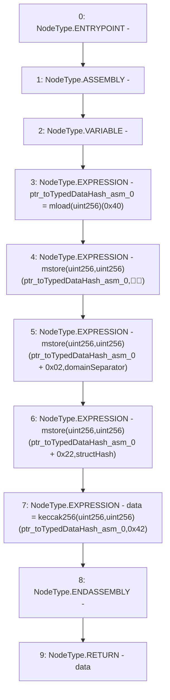

# Context: ECDSA.toTypedDataHash

**Contract:** `ECDSA` (Inherits: None)
**Signature:** `toTypedDataHash(bytes32,bytes32) returns (bytes32)`
**Method Selector ID:** `Internal (No Method ID)`
**Visibility:** `internal`
**Environment-Free:** `Yes`
**Modifiers:** None

### State Variables Interaction
- **Reads:** None
- **Writes:** None

### Environment & Verification Flags
- **Uses Foundry Cheatcodes:** No
- **Has Echidna Properties:** No

### Internal Calls Tree
- None

### External Calls / Value Transfers
- None

### Control Flow Graph (CFG)


### Source Mapping
Declared in: `certora-ac-datasets/detasets/web3bugs/dataset/web3bugs/52/node_modules/@openzeppelin/contracts/utils/cryptography/ECDSA.sol` on lines **197** to **206**

```solidity
    function toTypedDataHash(bytes32 domainSeparator, bytes32 structHash) internal pure returns (bytes32 data) {
        /// @solidity memory-safe-assembly
        assembly {
            let ptr := mload(0x40)
            mstore(ptr, "\x19\x01")
            mstore(add(ptr, 0x02), domainSeparator)
            mstore(add(ptr, 0x22), structHash)
            data := keccak256(ptr, 0x42)
        }
    }

```
