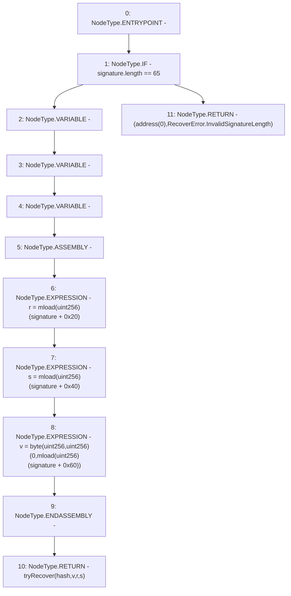

# Context: ECDSA.tryRecover

**Contract:** `ECDSA` (Inherits: None)
**Signature:** `tryRecover(bytes32,bytes) returns (address, ECDSA.RecoverError)`
**Method Selector ID:** `Internal (No Method ID)`
**Visibility:** `internal`
**Environment-Free:** `Yes`
**Modifiers:** None

### State Variables Interaction
- **Reads:** None
- **Writes:** None

### Environment & Verification Flags
- **Uses Foundry Cheatcodes:** No
- **Has Echidna Properties:** No

### Internal Calls Tree
- None

### External Calls / Value Transfers
- None

### Control Flow Graph (CFG)


### Source Mapping
Declared in: `certora-ac-datasets/detasets/web3bugs/dataset/web3bugs/52/node_modules/@openzeppelin/contracts/utils/cryptography/ECDSA.sol` on lines **55** to **72**

```solidity
    function tryRecover(bytes32 hash, bytes memory signature) internal pure returns (address, RecoverError) {
        if (signature.length == 65) {
            bytes32 r;
            bytes32 s;
            uint8 v;
            // ecrecover takes the signature parameters, and the only way to get them
            // currently is to use assembly.
            /// @solidity memory-safe-assembly
            assembly {
                r := mload(add(signature, 0x20))
                s := mload(add(signature, 0x40))
                v := byte(0, mload(add(signature, 0x60)))
            }
            return tryRecover(hash, v, r, s);
        } else {
            return (address(0), RecoverError.InvalidSignatureLength);
        }
    }

```
