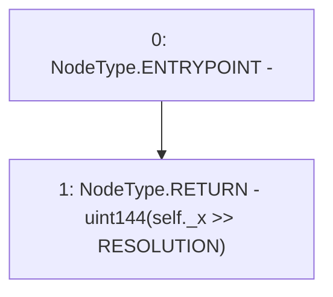

# Context: FixedPoint.decode144

**Contract:** `FixedPoint` (Inherits: None)
**Signature:** `decode144(FixedPoint.uq144x112) returns (uint144)`
**Method Selector ID:** `Internal (No Method ID)`
**Visibility:** `internal`
**Environment-Free:** `Yes`
**Modifiers:** None

### State Variables Interaction
- **Reads:** RESOLUTION
- **Writes:** None

### Environment & Verification Flags
- **Uses Foundry Cheatcodes:** No
- **Has Echidna Properties:** No

### Internal Calls Tree
- None

### External Calls / Value Transfers
- None

### Control Flow Graph (CFG)


### Source Mapping
Declared in: `certora-ac-datasets/detasets/web3bugs/dataset/web3bugs/52/contracts/external/libraries/FixedPoint.sol` on lines **44** to **46**

```solidity
    function decode144(uq144x112 memory self) internal pure returns (uint144) {
        return uint144(self._x >> RESOLUTION);
    }

```
