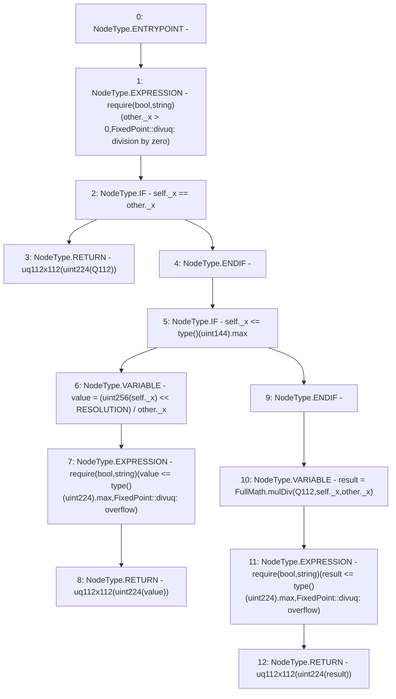

# Context: FixedPoint.divuq

**Contract:** `FixedPoint` (Inherits: None)
**Signature:** `divuq(FixedPoint.uq112x112,FixedPoint.uq112x112) returns (FixedPoint.uq112x112)`
**Method Selector ID:** `Internal (No Method ID)`
**Visibility:** `internal`
**Environment-Free:** `Yes`
**Modifiers:** None

### State Variables Interaction
- **Reads:** Q112, RESOLUTION
- **Writes:** None

### Assertion Checks & Business Requirements
- require/assert: `require(bool,string)(other._x > 0,FixedPoint::divuq: division by zero)`
- require/assert: `require(bool,string)(value <= type()(uint224).max,FixedPoint::divuq: overflow)`
- require/assert: `require(bool,string)(result <= type()(uint224).max,FixedPoint::divuq: overflow)`

### Environment & Verification Flags
- **Uses Foundry Cheatcodes:** No
- **Has Echidna Properties:** No

### Internal Calls Tree
- None

### External Calls / Value Transfers
- `FullMath.TMP_194(uint256) = LIBRARY_CALL, dest:FullMath, function:FullMath.mulDiv(uint256,uint256,uint256), arguments:['Q112', 'REF_21', 'REF_22'] `

### Control Flow Graph (CFG)


### Source Mapping
Declared in: `certora-ac-datasets/detasets/web3bugs/dataset/web3bugs/52/contracts/external/libraries/FixedPoint.sol` on lines **115** to **133**

```solidity
    function divuq(uq112x112 memory self, uq112x112 memory other)
        internal
        pure
        returns (uq112x112 memory)
    {
        require(other._x > 0, "FixedPoint::divuq: division by zero");
        if (self._x == other._x) {
            return uq112x112(uint224(Q112));
        }
        if (self._x <= type(uint144).max) {
            uint256 value = (uint256(self._x) << RESOLUTION) / other._x;
            require(value <= type(uint224).max, "FixedPoint::divuq: overflow");
            return uq112x112(uint224(value));
        }

        uint256 result = FullMath.mulDiv(Q112, self._x, other._x);
        require(result <= type(uint224).max, "FixedPoint::divuq: overflow");
        return uq112x112(uint224(result));
    }

```
