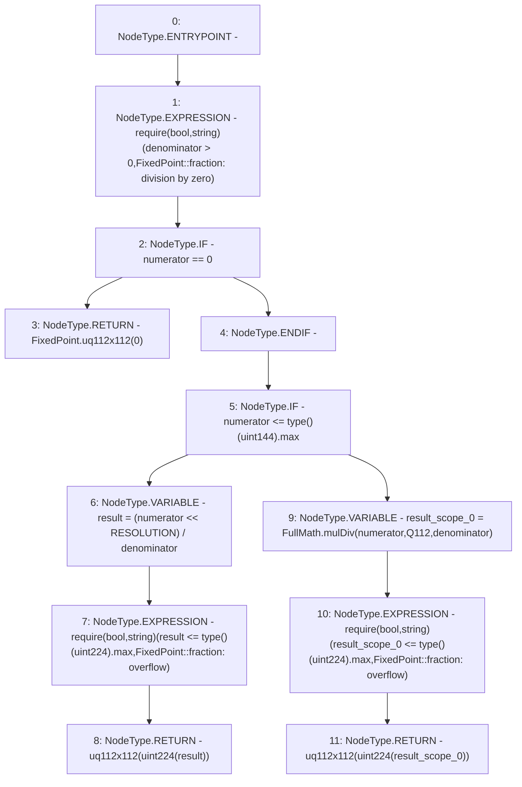

# Context: FixedPoint.fraction

**Contract:** `FixedPoint` (Inherits: None)
**Signature:** `fraction(uint256,uint256) returns (FixedPoint.uq112x112)`
**Method Selector ID:** `Internal (No Method ID)`
**Visibility:** `internal`
**Environment-Free:** `Yes`
**Modifiers:** None

### State Variables Interaction
- **Reads:** Q112, RESOLUTION
- **Writes:** None

### Assertion Checks & Business Requirements
- require/assert: `require(bool,string)(denominator > 0,FixedPoint::fraction: division by zero)`
- require/assert: `require(bool,string)(result <= type()(uint224).max,FixedPoint::fraction: overflow)`
- require/assert: `require(bool,string)(result_scope_0 <= type()(uint224).max,FixedPoint::fraction: overflow)`

### Environment & Verification Flags
- **Uses Foundry Cheatcodes:** No
- **Has Echidna Properties:** No

### Internal Calls Tree
- None

### External Calls / Value Transfers
- `FullMath.TMP_216(uint256) = LIBRARY_CALL, dest:FullMath, function:FullMath.mulDiv(uint256,uint256,uint256), arguments:['numerator', 'Q112', 'denominator'] `

### Control Flow Graph (CFG)


### Source Mapping
Declared in: `certora-ac-datasets/detasets/web3bugs/dataset/web3bugs/52/contracts/external/libraries/FixedPoint.sol` on lines **137** to **160**

```solidity
    function fraction(uint256 numerator, uint256 denominator)
        internal
        pure
        returns (uq112x112 memory)
    {
        require(denominator > 0, "FixedPoint::fraction: division by zero");
        if (numerator == 0) return FixedPoint.uq112x112(0);

        if (numerator <= type(uint144).max) {
            uint256 result = (numerator << RESOLUTION) / denominator;
            require(
                result <= type(uint224).max,
                "FixedPoint::fraction: overflow"
            );
            return uq112x112(uint224(result));
        } else {
            uint256 result = FullMath.mulDiv(numerator, Q112, denominator);
            require(
                result <= type(uint224).max,
                "FixedPoint::fraction: overflow"
            );
            return uq112x112(uint224(result));
        }
    }

```
