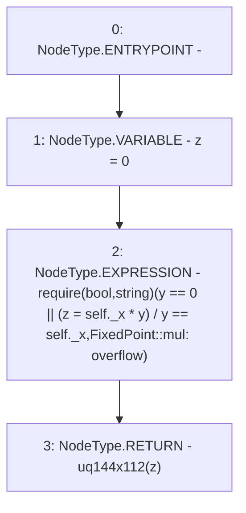

# Context: FixedPoint.mul

**Contract:** `FixedPoint` (Inherits: None)
**Signature:** `mul(FixedPoint.uq112x112,uint256) returns (FixedPoint.uq144x112)`
**Method Selector ID:** `Internal (No Method ID)`
**Visibility:** `internal`
**Environment-Free:** `Yes`
**Modifiers:** None

### State Variables Interaction
- **Reads:** None
- **Writes:** None

### Assertion Checks & Business Requirements
- require/assert: `require(bool,string)(y == 0 || (z = self._x * y) / y == self._x,FixedPoint::mul: overflow)`

### Environment & Verification Flags
- **Uses Foundry Cheatcodes:** No
- **Has Echidna Properties:** No

### Internal Calls Tree
- None

### External Calls / Value Transfers
- None

### Control Flow Graph (CFG)


### Source Mapping
Declared in: `certora-ac-datasets/detasets/web3bugs/dataset/web3bugs/52/contracts/external/libraries/FixedPoint.sol` on lines **50** to **61**

```solidity
    function mul(uq112x112 memory self, uint256 y)
        internal
        pure
        returns (uq144x112 memory)
    {
        uint256 z = 0;
        require(
            y == 0 || (z = self._x * y) / y == self._x,
            "FixedPoint::mul: overflow"
        );
        return uq144x112(z);
    }

```
