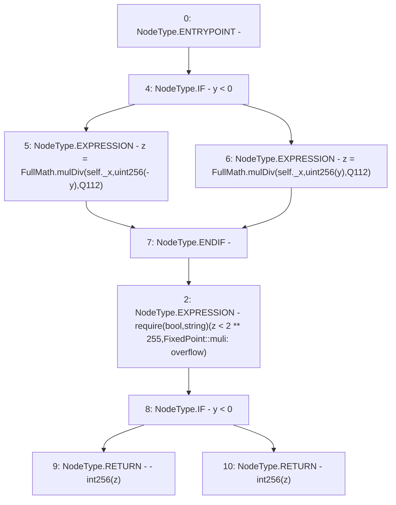

# Context: FixedPoint.muli

**Contract:** `FixedPoint` (Inherits: None)
**Signature:** `muli(FixedPoint.uq112x112,int256) returns (int256)`
**Method Selector ID:** `Internal (No Method ID)`
**Visibility:** `internal`
**Environment-Free:** `Yes`
**Modifiers:** None

### State Variables Interaction
- **Reads:** Q112
- **Writes:** None

### Assertion Checks & Business Requirements
- require/assert: `require(bool,string)(z < 2 ** 255,FixedPoint::muli: overflow)`

### Environment & Verification Flags
- **Uses Foundry Cheatcodes:** No
- **Has Echidna Properties:** No

### Internal Calls Tree
- None

### External Calls / Value Transfers
- `FullMath.TMP_134(uint256) = LIBRARY_CALL, dest:FullMath, function:FullMath.mulDiv(uint256,uint256,uint256), arguments:['REF_5', 'TMP_133', 'Q112'] `
- `FullMath.TMP_136(uint256) = LIBRARY_CALL, dest:FullMath, function:FullMath.mulDiv(uint256,uint256,uint256), arguments:['REF_7', 'TMP_135', 'Q112'] `

### Control Flow Graph (CFG)


### Source Mapping
Declared in: `certora-ac-datasets/detasets/web3bugs/dataset/web3bugs/52/contracts/external/libraries/FixedPoint.sol` on lines **65** to **73**

```solidity
    function muli(uq112x112 memory self, int256 y)
        internal
        pure
        returns (int256)
    {
        uint256 z = FullMath.mulDiv(self._x, uint256(y < 0 ? -y : y), Q112);
        require(z < 2**255, "FixedPoint::muli: overflow");
        return y < 0 ? -int256(z) : int256(z);
    }

```
