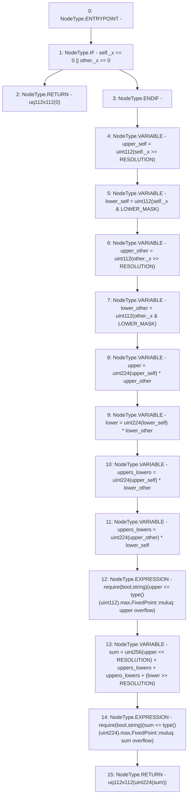

# Context: FixedPoint.muluq

**Contract:** `FixedPoint` (Inherits: None)
**Signature:** `muluq(FixedPoint.uq112x112,FixedPoint.uq112x112) returns (FixedPoint.uq112x112)`
**Method Selector ID:** `Internal (No Method ID)`
**Visibility:** `internal`
**Environment-Free:** `Yes`
**Modifiers:** None

### State Variables Interaction
- **Reads:** LOWER_MASK, RESOLUTION
- **Writes:** None

### Assertion Checks & Business Requirements
- require/assert: `require(bool,string)(upper <= type()(uint112).max,FixedPoint::muluq: upper overflow)`
- require/assert: `require(bool,string)(sum <= type()(uint224).max,FixedPoint::muluq: sum overflow)`

### Environment & Verification Flags
- **Uses Foundry Cheatcodes:** No
- **Has Echidna Properties:** No

### Internal Calls Tree
- None

### External Calls / Value Transfers
- None

### Control Flow Graph (CFG)


### Source Mapping
Declared in: `certora-ac-datasets/detasets/web3bugs/dataset/web3bugs/52/contracts/external/libraries/FixedPoint.sol` on lines **77** to **112**

```solidity
    function muluq(uq112x112 memory self, uq112x112 memory other)
        internal
        pure
        returns (uq112x112 memory)
    {
        if (self._x == 0 || other._x == 0) {
            return uq112x112(0);
        }
        uint112 upper_self = uint112(self._x >> RESOLUTION); // * 2^0
        uint112 lower_self = uint112(self._x & LOWER_MASK); // * 2^-112
        uint112 upper_other = uint112(other._x >> RESOLUTION); // * 2^0
        uint112 lower_other = uint112(other._x & LOWER_MASK); // * 2^-112

        // partial products
        uint224 upper = uint224(upper_self) * upper_other; // * 2^0
        uint224 lower = uint224(lower_self) * lower_other; // * 2^-224
        uint224 uppers_lowero = uint224(upper_self) * lower_other; // * 2^-112
        uint224 uppero_lowers = uint224(upper_other) * lower_self; // * 2^-112

        // so the bit shift does not overflow
        require(
            upper <= type(uint112).max,
            "FixedPoint::muluq: upper overflow"
        );

        // this cannot exceed 256 bits, all values are 224 bits
        uint256 sum = uint256(upper << RESOLUTION) +
            uppers_lowero +
            uppero_lowers +
            (lower >> RESOLUTION);

        // so the cast does not overflow
        require(sum <= type(uint224).max, "FixedPoint::muluq: sum overflow");

        return uq112x112(uint224(sum));
    }

```
