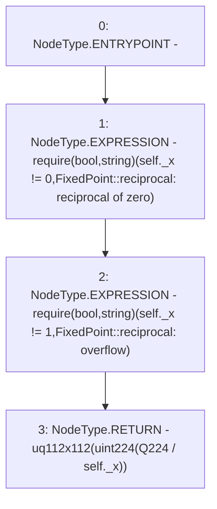

# Context: FixedPoint.reciprocal

**Contract:** `FixedPoint` (Inherits: None)
**Signature:** `reciprocal(FixedPoint.uq112x112) returns (FixedPoint.uq112x112)`
**Method Selector ID:** `Internal (No Method ID)`
**Visibility:** `internal`
**Environment-Free:** `Yes`
**Modifiers:** None

### State Variables Interaction
- **Reads:** Q224
- **Writes:** None

### Assertion Checks & Business Requirements
- require/assert: `require(bool,string)(self._x != 0,FixedPoint::reciprocal: reciprocal of zero)`
- require/assert: `require(bool,string)(self._x != 1,FixedPoint::reciprocal: overflow)`

### Environment & Verification Flags
- **Uses Foundry Cheatcodes:** No
- **Has Echidna Properties:** No

### Internal Calls Tree
- None

### External Calls / Value Transfers
- None

### Control Flow Graph (CFG)


### Source Mapping
Declared in: `certora-ac-datasets/detasets/web3bugs/dataset/web3bugs/52/contracts/external/libraries/FixedPoint.sol` on lines **165** to **173**

```solidity
    function reciprocal(uq112x112 memory self)
        internal
        pure
        returns (uq112x112 memory)
    {
        require(self._x != 0, "FixedPoint::reciprocal: reciprocal of zero");
        require(self._x != 1, "FixedPoint::reciprocal: overflow");
        return uq112x112(uint224(Q224 / self._x));
    }

```
