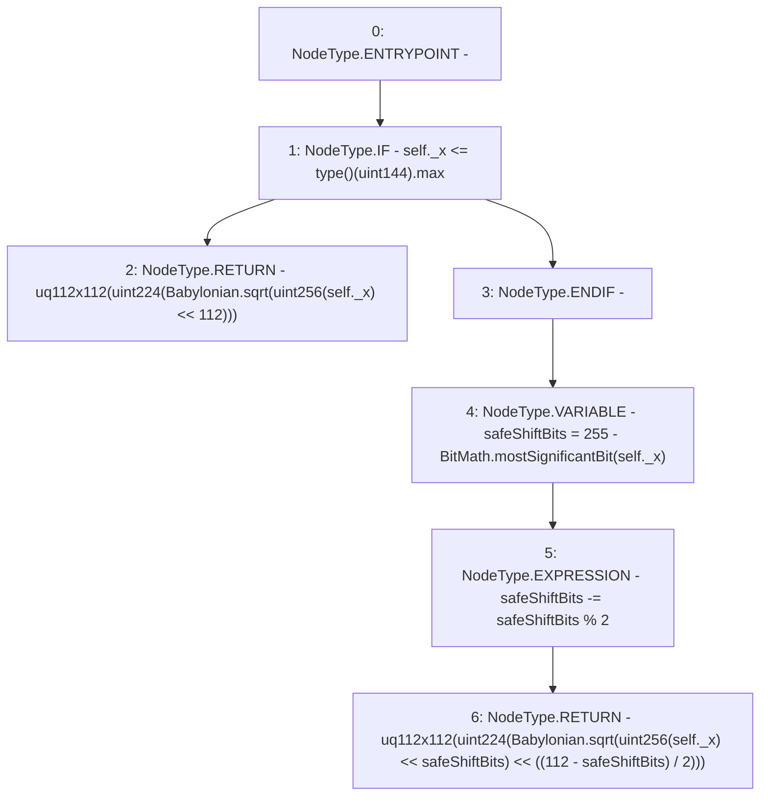

# Context: FixedPoint.sqrt

**Contract:** `FixedPoint` (Inherits: None)
**Signature:** `sqrt(FixedPoint.uq112x112) returns (FixedPoint.uq112x112)`
**Method Selector ID:** `Internal (No Method ID)`
**Visibility:** `internal`
**Environment-Free:** `Yes`
**Modifiers:** None

### State Variables Interaction
- **Reads:** None
- **Writes:** None

### Environment & Verification Flags
- **Uses Foundry Cheatcodes:** No
- **Has Echidna Properties:** No

### Internal Calls Tree
- None

### External Calls / Value Transfers
- `BitMath.TMP_238(uint8) = LIBRARY_CALL, dest:BitMath, function:BitMath.mostSignificantBit(uint256), arguments:['REF_32'] `
- `Babylonian.TMP_235(uint256) = LIBRARY_CALL, dest:Babylonian, function:Babylonian.sqrt(uint256), arguments:['TMP_234'] `
- `Babylonian.TMP_243(uint256) = LIBRARY_CALL, dest:Babylonian, function:Babylonian.sqrt(uint256), arguments:['TMP_242'] `

### Control Flow Graph (CFG)


### Source Mapping
Declared in: `certora-ac-datasets/detasets/web3bugs/dataset/web3bugs/52/contracts/external/libraries/FixedPoint.sol` on lines **177** to **195**

```solidity
    function sqrt(uq112x112 memory self)
        internal
        pure
        returns (uq112x112 memory)
    {
        if (self._x <= type(uint144).max) {
            return uq112x112(uint224(Babylonian.sqrt(uint256(self._x) << 112)));
        }

        uint8 safeShiftBits = 255 - BitMath.mostSignificantBit(self._x);
        safeShiftBits -= safeShiftBits % 2;
        return
            uq112x112(
                uint224(
                    Babylonian.sqrt(uint256(self._x) << safeShiftBits) <<
                        ((112 - safeShiftBits) / 2)
                )
            );
    }

```
