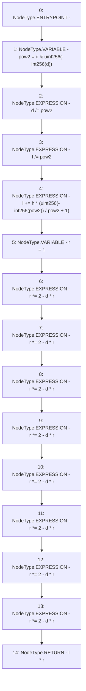

# Context: FullMath.fullDiv

**Contract:** `FullMath` (Inherits: None)
**Signature:** `fullDiv(uint256,uint256,uint256) returns (uint256)`
**Method Selector ID:** `Internal (No Method ID)`
**Visibility:** `private`
**Environment-Free:** `Yes`
**Modifiers:** None

### State Variables Interaction
- **Reads:** None
- **Writes:** None

### Environment & Verification Flags
- **Uses Foundry Cheatcodes:** No
- **Has Echidna Properties:** No

### Internal Calls Tree
- None

### External Calls / Value Transfers
- None

### Control Flow Graph (CFG)


### Source Mapping
Declared in: `certora-ac-datasets/detasets/web3bugs/dataset/web3bugs/52/contracts/external/libraries/FullMath.sol` on lines **18** to **37**

```solidity
    function fullDiv(
        uint256 l,
        uint256 h,
        uint256 d
    ) private pure returns (uint256) {
        uint256 pow2 = d & uint256(-int256(d));
        d /= pow2;
        l /= pow2;
        l += h * (uint256(-int256(pow2)) / pow2 + 1);
        uint256 r = 1;
        r *= 2 - d * r;
        r *= 2 - d * r;
        r *= 2 - d * r;
        r *= 2 - d * r;
        r *= 2 - d * r;
        r *= 2 - d * r;
        r *= 2 - d * r;
        r *= 2 - d * r;
        return l * r;
    }

```
