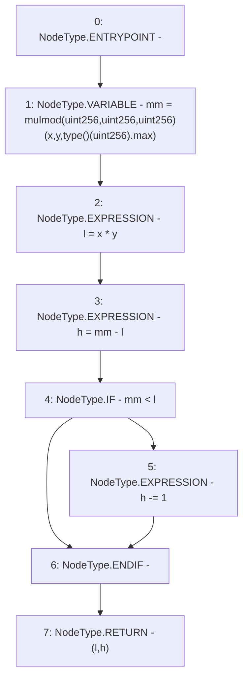

# Context: FullMath.fullMul

**Contract:** `FullMath` (Inherits: None)
**Signature:** `fullMul(uint256,uint256) returns (uint256, uint256)`
**Method Selector ID:** `Internal (No Method ID)`
**Visibility:** `internal`
**Environment-Free:** `Yes`
**Modifiers:** None

### State Variables Interaction
- **Reads:** None
- **Writes:** None

### Environment & Verification Flags
- **Uses Foundry Cheatcodes:** No
- **Has Echidna Properties:** No

### Internal Calls Tree
- None

### External Calls / Value Transfers
- None

### Control Flow Graph (CFG)


### Source Mapping
Declared in: `certora-ac-datasets/detasets/web3bugs/dataset/web3bugs/52/contracts/external/libraries/FullMath.sol` on lines **7** to **16**

```solidity
    function fullMul(uint256 x, uint256 y)
        internal
        pure
        returns (uint256 l, uint256 h)
    {
        uint256 mm = mulmod(x, y, type(uint256).max);
        l = x * y;
        h = mm - l;
        if (mm < l) h -= 1;
    }

```
