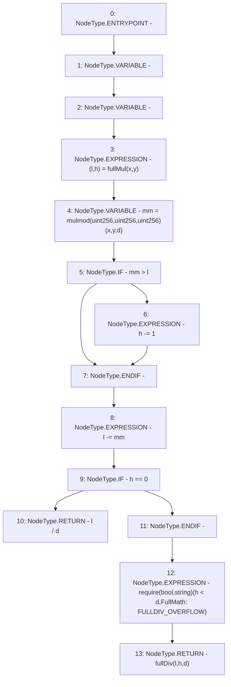

# Context: FullMath.mulDiv

**Contract:** `FullMath` (Inherits: None)
**Signature:** `mulDiv(uint256,uint256,uint256) returns (uint256)`
**Method Selector ID:** `Internal (No Method ID)`
**Visibility:** `internal`
**Environment-Free:** `Yes`
**Modifiers:** None

### State Variables Interaction
- **Reads:** None
- **Writes:** None

### Assertion Checks & Business Requirements
- require/assert: `require(bool,string)(h < d,FullMath: FULLDIV_OVERFLOW)`

### Environment & Verification Flags
- **Uses Foundry Cheatcodes:** No
- **Has Echidna Properties:** No

### Internal Calls Tree
- None

### External Calls / Value Transfers
- None

### Control Flow Graph (CFG)


### Source Mapping
Declared in: `certora-ac-datasets/detasets/web3bugs/dataset/web3bugs/52/contracts/external/libraries/FullMath.sol` on lines **39** to **54**

```solidity
    function mulDiv(
        uint256 x,
        uint256 y,
        uint256 d
    ) internal pure returns (uint256) {
        (uint256 l, uint256 h) = fullMul(x, y);

        uint256 mm = mulmod(x, y, d);
        if (mm > l) h -= 1;
        l -= mm;

        if (h == 0) return l / d;

        require(h < d, "FullMath: FULLDIV_OVERFLOW");
        return fullDiv(l, h, d);
    }

```
