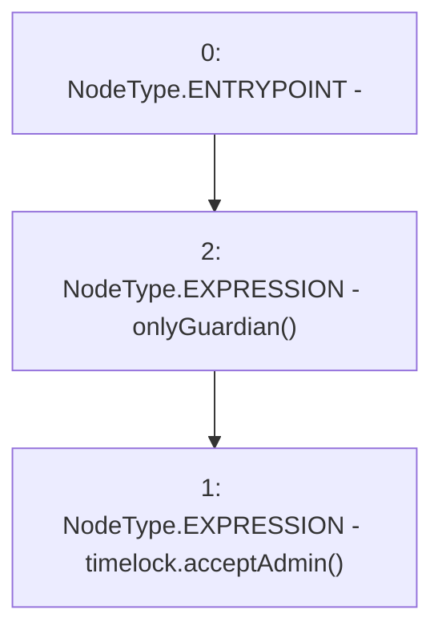

# Context: GovernorAlpha.__acceptAdmin

**Contract:** `GovernorAlpha` (Inherits: None)
**Signature:** `__acceptAdmin()`
**Method Selector ID:** `0xb9a61961`
**Visibility:** `public`
**Environment-Free:** `No (reads EVM state context)`
**Modifiers:**
- `onlyGuardian`
  ```solidity
  modifier onlyGuardian() {
          _onlyGuardian();
          _;
      }
  ```

### State Variables Interaction
- **Reads:** timelock
- **Writes:** None

### Environment & Verification Flags
- **Uses Foundry Cheatcodes:** No
- **Has Echidna Properties:** No

### Internal Calls Tree
- None

### External Calls / Value Transfers
- `ITimelock.HIGH_LEVEL_CALL, dest:timelock(ITimelock), function:acceptAdmin, arguments:[]  `

### Control Flow Graph (CFG)


### Source Mapping
Declared in: `certora-ac-datasets/detasets/web3bugs/dataset/web3bugs/52/contracts/governance/GovernorAlpha.sol` on lines **640** to **642**

```solidity
    function __acceptAdmin() public onlyGuardian {
        timelock.acceptAdmin();
    }

```
