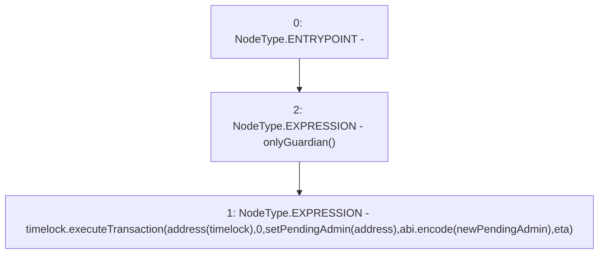

# Context: GovernorAlpha.__executeSetTimelockPendingAdmin

**Contract:** `GovernorAlpha` (Inherits: None)
**Signature:** `__executeSetTimelockPendingAdmin(address,uint256)`
**Method Selector ID:** `0x21f43e42`
**Visibility:** `public`
**Environment-Free:** `No (reads EVM state context)`
**Modifiers:**
- `onlyGuardian`
  ```solidity
  modifier onlyGuardian() {
          _onlyGuardian();
          _;
      }
  ```

### State Variables Interaction
- **Reads:** timelock
- **Writes:** None

### Environment & Verification Flags
- **Uses Foundry Cheatcodes:** No
- **Has Echidna Properties:** No

### Internal Calls Tree
- None

### External Calls / Value Transfers
- `ITimelock.TMP_133(bytes) = HIGH_LEVEL_CALL, dest:timelock(ITimelock), function:executeTransaction, arguments:['TMP_131', '0', 'setPendingAdmin(address)', 'TMP_132', 'eta']  `

### Control Flow Graph (CFG)


### Source Mapping
Declared in: `certora-ac-datasets/detasets/web3bugs/dataset/web3bugs/52/contracts/governance/GovernorAlpha.sol` on lines **679** to **690**

```solidity
    function __executeSetTimelockPendingAdmin(
        address newPendingAdmin,
        uint256 eta
    ) public onlyGuardian {
        timelock.executeTransaction(
            address(timelock),
            0,
            "setPendingAdmin(address)",
            abi.encode(newPendingAdmin),
            eta
        );
    }

```
