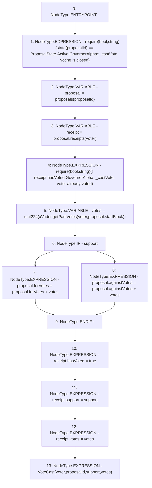

# Context: GovernorAlpha._castVote

**Contract:** `GovernorAlpha` (Inherits: None)
**Signature:** `_castVote(address,uint256,bool)`
**Method Selector ID:** `Internal (No Method ID)`
**Visibility:** `internal`
**Environment-Free:** `No (reads EVM state context)`
**Modifiers:** None

### State Variables Interaction
- **Reads:** proposals, xVader
- **Writes:** proposals

### Assertion Checks & Business Requirements
- require/assert: `require(bool,string)(state(proposalId) == ProposalState.Active,GovernorAlpha::_castVote: voting is closed)`
- require/assert: `require(bool,string)(! receipt.hasVoted,GovernorAlpha::_castVote: voter already voted)`

### Environment & Verification Flags
- **Uses Foundry Cheatcodes:** No
- **Has Echidna Properties:** No

### Internal Calls Tree
- None

### External Calls / Value Transfers
- `IXVader.TMP_146(uint256) = HIGH_LEVEL_CALL, dest:xVader(IXVader), function:getPastVotes, arguments:['voter', 'REF_130']  `

### Control Flow Graph (CFG)


### Source Mapping
Declared in: `certora-ac-datasets/detasets/web3bugs/dataset/web3bugs/52/contracts/governance/GovernorAlpha.sol` on lines **728** to **761**

```solidity
    function _castVote(
        address voter,
        uint256 proposalId,
        bool support
    ) internal {
        require(
            state(proposalId) == ProposalState.Active,
            "GovernorAlpha::_castVote: voting is closed"
        );

        Proposal storage proposal = proposals[proposalId];
        Receipt storage receipt = proposal.receipts[voter];

        require(
            !receipt.hasVoted,
            "GovernorAlpha::_castVote: voter already voted"
        );

        // optimistically casting to uint224 as xVader contract performs the checks for
        // votes to not overflow uint224.
        uint224 votes = uint224(xVader.getPastVotes(voter, proposal.startBlock));

        if (support) {
            proposal.forVotes = proposal.forVotes + votes;
        } else {
            proposal.againstVotes = proposal.againstVotes + votes;
        }

        receipt.hasVoted = true;
        receipt.support = support;
        receipt.votes = votes;

        emit VoteCast(voter, proposalId, support, votes);
    }

```
