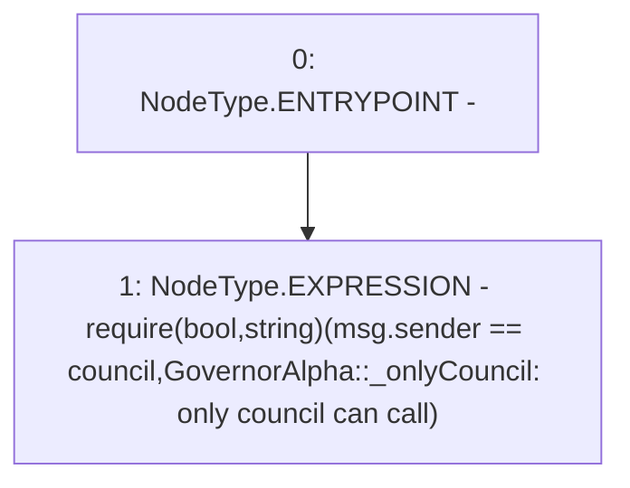

# Context: GovernorAlpha._onlyCouncil

**Contract:** `GovernorAlpha` (Inherits: None)
**Signature:** `_onlyCouncil()`
**Method Selector ID:** `Internal (No Method ID)`
**Visibility:** `private`
**Environment-Free:** `No (reads EVM state context)`
**Modifiers:** None

### State Variables Interaction
- **Reads:** council
- **Writes:** None

### Assertion Checks & Business Requirements
- require/assert: `require(bool,string)(msg.sender == council,GovernorAlpha::_onlyCouncil: only council can call)`

### Environment & Verification Flags
- **Uses Foundry Cheatcodes:** No
- **Has Echidna Properties:** No

### Internal Calls Tree
- None

### External Calls / Value Transfers
- None

### Control Flow Graph (CFG)


### Source Mapping
Declared in: `certora-ac-datasets/detasets/web3bugs/dataset/web3bugs/52/contracts/governance/GovernorAlpha.sol` on lines **789** to **794**

```solidity
    function _onlyCouncil() private view {
        require(
            msg.sender == council,
            "GovernorAlpha::_onlyCouncil: only council can call"
        );
    }

```
