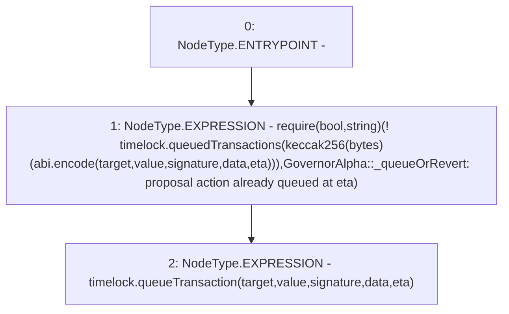

# Context: GovernorAlpha._queueOrRevert

**Contract:** `GovernorAlpha` (Inherits: None)
**Signature:** `_queueOrRevert(address,uint256,string,bytes,uint256)`
**Method Selector ID:** `Internal (No Method ID)`
**Visibility:** `internal`
**Environment-Free:** `Yes`
**Modifiers:** None

### State Variables Interaction
- **Reads:** timelock
- **Writes:** None

### Assertion Checks & Business Requirements
- require/assert: `require(bool,string)(! timelock.queuedTransactions(keccak256(bytes)(abi.encode(target,value,signature,data,eta))),GovernorAlpha::_queueOrRevert: proposal action already queued at eta)`

### Environment & Verification Flags
- **Uses Foundry Cheatcodes:** No
- **Has Echidna Properties:** No

### Internal Calls Tree
- None

### External Calls / Value Transfers
- `ITimelock.TMP_140(bytes32) = HIGH_LEVEL_CALL, dest:timelock(ITimelock), function:queueTransaction, arguments:['target', 'value', 'signature', 'data', 'eta']  `
- `ITimelock.TMP_137(bool) = HIGH_LEVEL_CALL, dest:timelock(ITimelock), function:queuedTransactions, arguments:['TMP_136']  `

### Control Flow Graph (CFG)


### Source Mapping
Declared in: `certora-ac-datasets/detasets/web3bugs/dataset/web3bugs/52/contracts/governance/GovernorAlpha.sol` on lines **701** to **715**

```solidity
    function _queueOrRevert(
        address target,
        uint256 value,
        string memory signature,
        bytes memory data,
        uint256 eta
    ) internal {
        require(
            !timelock.queuedTransactions(
                keccak256(abi.encode(target, value, signature, data, eta))
            ),
            "GovernorAlpha::_queueOrRevert: proposal action already queued at eta"
        );
        timelock.queueTransaction(target, value, signature, data, eta);
    }

```
