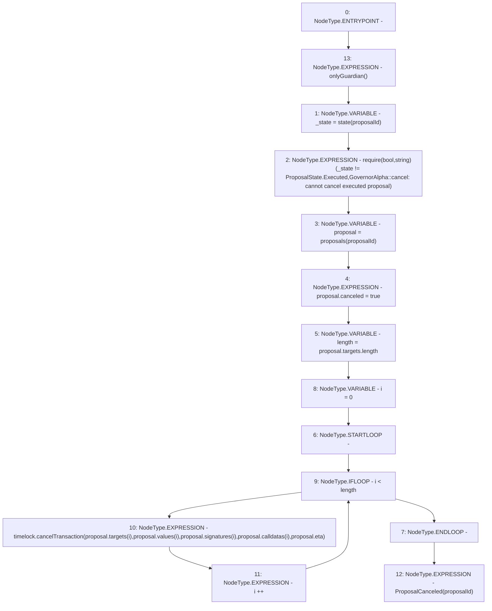

# Context: GovernorAlpha.cancel

**Contract:** `GovernorAlpha` (Inherits: None)
**Signature:** `cancel(uint256)`
**Method Selector ID:** `0x40e58ee5`
**Visibility:** `public`
**Environment-Free:** `No (reads EVM state context)`
**Modifiers:**
- `onlyGuardian`
  ```solidity
  modifier onlyGuardian() {
          _onlyGuardian();
          _;
      }
  ```

### State Variables Interaction
- **Reads:** proposals, timelock
- **Writes:** proposals

### Assertion Checks & Business Requirements
- require/assert: `require(bool,string)(_state != ProposalState.Executed,GovernorAlpha::cancel: cannot cancel executed proposal)`

### Environment & Verification Flags
- **Uses Foundry Cheatcodes:** No
- **Has Echidna Properties:** No

### Internal Calls Tree
- None

### External Calls / Value Transfers
- `ITimelock.HIGH_LEVEL_CALL, dest:timelock(ITimelock), function:cancelTransaction, arguments:['REF_108', 'REF_110', 'REF_112', 'REF_114', 'REF_115']  `

### Control Flow Graph (CFG)


### Source Mapping
Declared in: `certora-ac-datasets/detasets/web3bugs/dataset/web3bugs/52/contracts/governance/GovernorAlpha.sol` on lines **609** to **630**

```solidity
    function cancel(uint256 proposalId) public onlyGuardian {
        ProposalState _state = state(proposalId);
        require(
            _state != ProposalState.Executed,
            "GovernorAlpha::cancel: cannot cancel executed proposal"
        );

        Proposal storage proposal = proposals[proposalId];
        proposal.canceled = true;
        uint256 length = proposal.targets.length;
        for (uint256 i = 0; i < length; i++) {
            timelock.cancelTransaction(
                proposal.targets[i],
                proposal.values[i],
                proposal.signatures[i],
                proposal.calldatas[i],
                proposal.eta
            );
        }

        emit ProposalCanceled(proposalId);
    }

```
