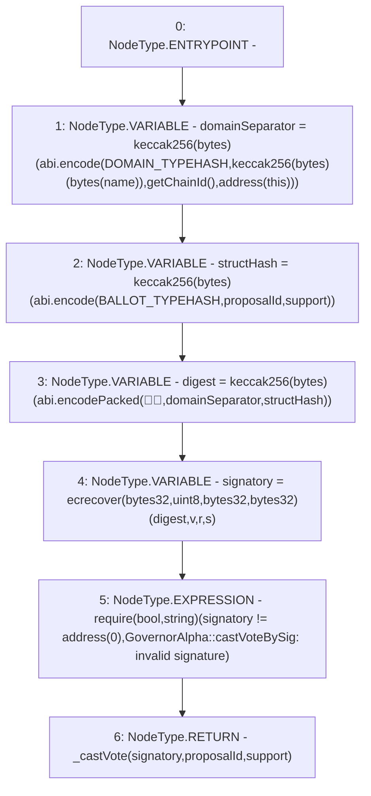

# Context: GovernorAlpha.castVoteBySig

**Contract:** `GovernorAlpha` (Inherits: None)
**Signature:** `castVoteBySig(uint256,bool,uint8,bytes32,bytes32)`
**Method Selector ID:** `0x4634c61f`
**Visibility:** `public`
**Environment-Free:** `No (reads EVM state context)`
**Modifiers:** None

### State Variables Interaction
- **Reads:** BALLOT_TYPEHASH, DOMAIN_TYPEHASH, name
- **Writes:** None

### Assertion Checks & Business Requirements
- require/assert: `require(bool,string)(signatory != address(0),GovernorAlpha::castVoteBySig: invalid signature)`

### Environment & Verification Flags
- **Uses Foundry Cheatcodes:** No
- **Has Echidna Properties:** No

### Internal Calls Tree
- None

### External Calls / Value Transfers
- None

### Control Flow Graph (CFG)


### Source Mapping
Declared in: `certora-ac-datasets/detasets/web3bugs/dataset/web3bugs/52/contracts/governance/GovernorAlpha.sol` on lines **492** to **524**

```solidity
    function castVoteBySig(
        uint256 proposalId,
        bool support,
        uint8 v,
        bytes32 r,
        bytes32 s
    ) public {
        bytes32 domainSeparator = keccak256(
            abi.encode(
                DOMAIN_TYPEHASH,
                keccak256(bytes(name)),
                getChainId(),
                address(this)
            )
        );

        bytes32 structHash = keccak256(
            abi.encode(BALLOT_TYPEHASH, proposalId, support)
        );

        bytes32 digest = keccak256(
            abi.encodePacked("\x19\x01", domainSeparator, structHash)
        );

        address signatory = ecrecover(digest, v, r, s);

        require(
            signatory != address(0),
            "GovernorAlpha::castVoteBySig: invalid signature"
        );

        return _castVote(signatory, proposalId, support);
    }

```
