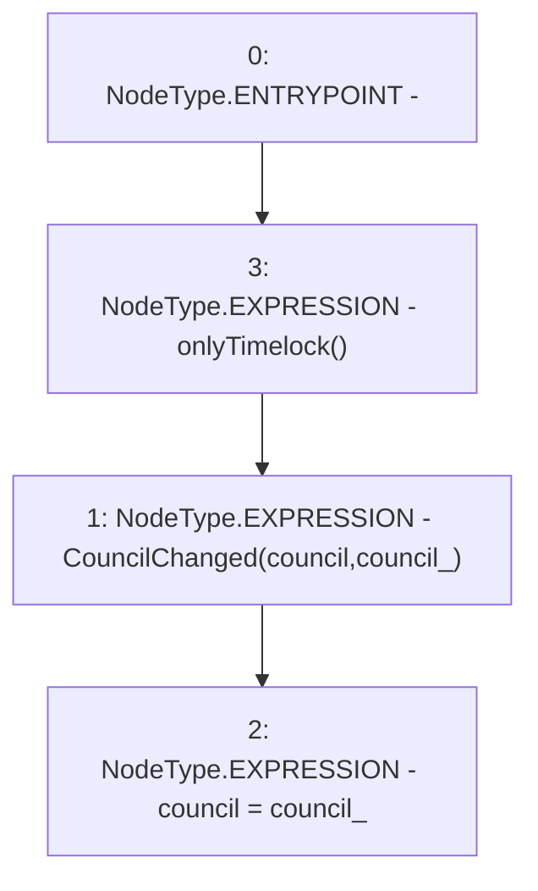

# Context: GovernorAlpha.changeCouncil

**Contract:** `GovernorAlpha` (Inherits: None)
**Signature:** `changeCouncil(address)`
**Method Selector ID:** `0x02c3b436`
**Visibility:** `external`
**Environment-Free:** `No (reads EVM state context)`
**Modifiers:**
- `onlyTimelock`
  ```solidity
  modifier onlyTimelock() {
          _onlyTimelock();
          _;
      }
  ```

### State Variables Interaction
- **Reads:** council
- **Writes:** council

### Environment & Verification Flags
- **Uses Foundry Cheatcodes:** No
- **Has Echidna Properties:** No

### Internal Calls Tree
- None

### External Calls / Value Transfers
- None

### Control Flow Graph (CFG)


### Source Mapping
Declared in: `certora-ac-datasets/detasets/web3bugs/dataset/web3bugs/52/contracts/governance/GovernorAlpha.sol` on lines **596** to **599**

```solidity
    function changeCouncil(address council_) external onlyTimelock {
        emit CouncilChanged(council, council_);
        council = council_;
    }

```
