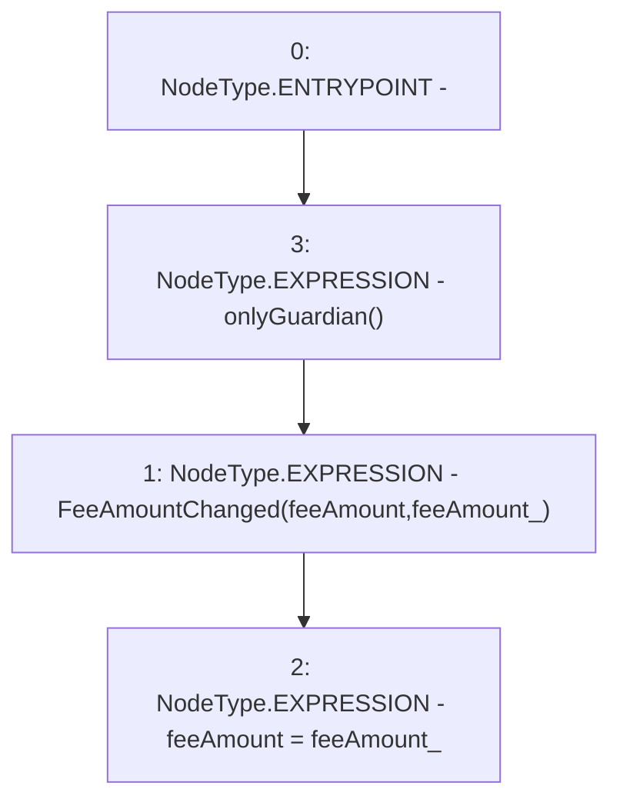

# Context: GovernorAlpha.changeFeeAmount

**Contract:** `GovernorAlpha` (Inherits: None)
**Signature:** `changeFeeAmount(uint256)`
**Method Selector ID:** `0x2f376586`
**Visibility:** `external`
**Environment-Free:** `No (reads EVM state context)`
**Modifiers:**
- `onlyGuardian`
  ```solidity
  modifier onlyGuardian() {
          _onlyGuardian();
          _;
      }
  ```

### State Variables Interaction
- **Reads:** feeAmount
- **Writes:** feeAmount

### Environment & Verification Flags
- **Uses Foundry Cheatcodes:** No
- **Has Echidna Properties:** No

### Internal Calls Tree
- None

### External Calls / Value Transfers
- None

### Control Flow Graph (CFG)


### Source Mapping
Declared in: `certora-ac-datasets/detasets/web3bugs/dataset/web3bugs/52/contracts/governance/GovernorAlpha.sol` on lines **545** to **548**

```solidity
    function changeFeeAmount(uint256 feeAmount_) external onlyGuardian {
        emit FeeAmountChanged(feeAmount, feeAmount_);
        feeAmount = feeAmount_;
    }

```
