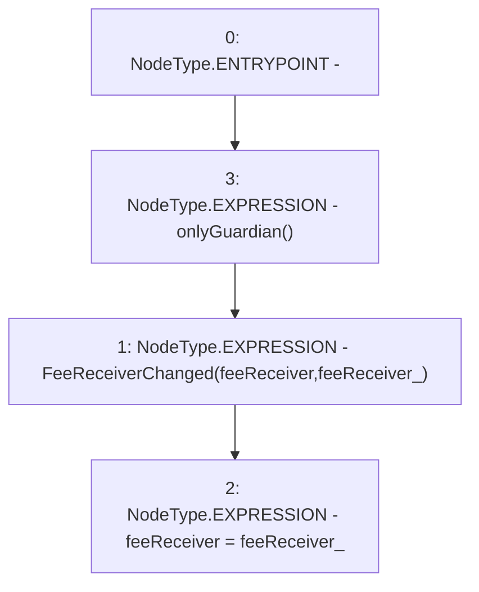

# Context: GovernorAlpha.changeFeeReceiver

**Contract:** `GovernorAlpha` (Inherits: None)
**Signature:** `changeFeeReceiver(address)`
**Method Selector ID:** `0x7c08b964`
**Visibility:** `external`
**Environment-Free:** `No (reads EVM state context)`
**Modifiers:**
- `onlyGuardian`
  ```solidity
  modifier onlyGuardian() {
          _onlyGuardian();
          _;
      }
  ```

### State Variables Interaction
- **Reads:** feeReceiver
- **Writes:** feeReceiver

### Environment & Verification Flags
- **Uses Foundry Cheatcodes:** No
- **Has Echidna Properties:** No

### Internal Calls Tree
- None

### External Calls / Value Transfers
- None

### Control Flow Graph (CFG)


### Source Mapping
Declared in: `certora-ac-datasets/detasets/web3bugs/dataset/web3bugs/52/contracts/governance/GovernorAlpha.sol` on lines **534** to **537**

```solidity
    function changeFeeReceiver(address feeReceiver_) external onlyGuardian {
        emit FeeReceiverChanged(feeReceiver, feeReceiver_);
        feeReceiver = feeReceiver_;
    }

```
