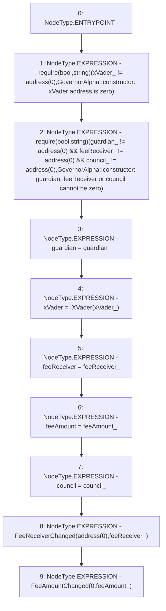

# Context: GovernorAlpha.constructor

**Contract:** `GovernorAlpha` (Inherits: None)
**Signature:** `constructor(address,address,address,uint256,address)`
**Method Selector ID:** `0x986d112d`
**Visibility:** `public`
**Environment-Free:** `Yes`
**Modifiers:** None

### State Variables Interaction
- **Reads:** None
- **Writes:** council, feeAmount, feeReceiver, guardian, xVader

### Assertion Checks & Business Requirements
- require/assert: `require(bool,string)(xVader_ != address(0),GovernorAlpha::constructor: xVader address is zero)`
- require/assert: `require(bool,string)(guardian_ != address(0) && feeReceiver_ != address(0) && council_ != address(0),GovernorAlpha::constructor: guardian, feeReceiver or council cannot be zero)`

### Environment & Verification Flags
- **Uses Foundry Cheatcodes:** No
- **Has Echidna Properties:** No

### Internal Calls Tree
- None

### External Calls / Value Transfers
- None

### Control Flow Graph (CFG)


### Source Mapping
Declared in: `certora-ac-datasets/detasets/web3bugs/dataset/web3bugs/52/contracts/governance/GovernorAlpha.sol` on lines **193** to **220**

```solidity
    constructor(
        address guardian_,
        address xVader_,
        address feeReceiver_,
        uint256 feeAmount_,
        address council_
    ) {
        require(
            xVader_ != address(0),
            "GovernorAlpha::constructor: xVader address is zero"
        );

        require(
            guardian_ != address(0) &&
                feeReceiver_ != address(0) &&
                council_ != address(0),
            "GovernorAlpha::constructor: guardian, feeReceiver or council cannot be zero"
        );

        guardian = guardian_;
        xVader = IXVader(xVader_);
        feeReceiver = feeReceiver_;
        feeAmount = feeAmount_;
        council = council_;

        emit FeeReceiverChanged(address(0), feeReceiver_);
        emit FeeAmountChanged(0, feeAmount_);
    }

```
