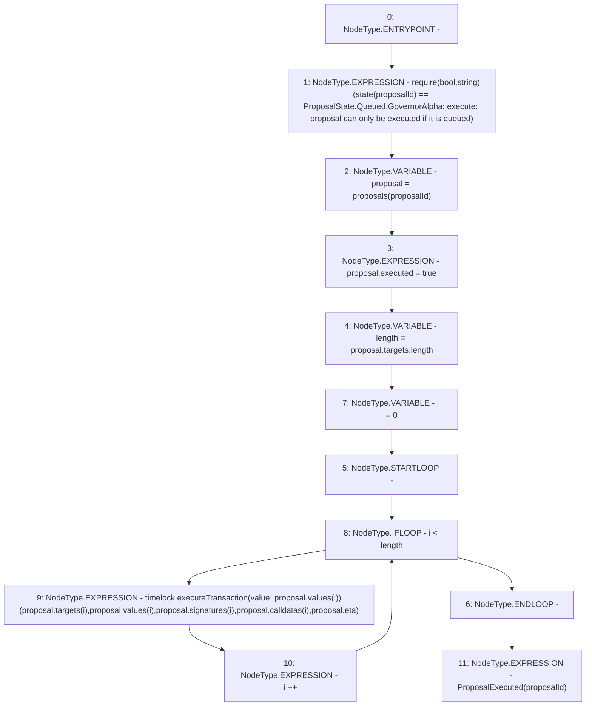

# Context: GovernorAlpha.execute

**Contract:** `GovernorAlpha` (Inherits: None)
**Signature:** `execute(uint256)`
**Method Selector ID:** `0xfe0d94c1`
**Visibility:** `public`
**Environment-Free:** `No (reads EVM state context)`
**Modifiers:** None

### State Variables Interaction
- **Reads:** proposals, timelock
- **Writes:** proposals

### Assertion Checks & Business Requirements
- require/assert: `require(bool,string)(state(proposalId) == ProposalState.Queued,GovernorAlpha::execute: proposal can only be executed if it is queued)`

### Environment & Verification Flags
- **Uses Foundry Cheatcodes:** No
- **Has Echidna Properties:** No

### Internal Calls Tree
- None

### External Calls / Value Transfers
- `ITimelock.TMP_77(bytes) = HIGH_LEVEL_CALL, dest:timelock(ITimelock), function:executeTransaction, arguments:['REF_79', 'REF_81', 'REF_83', 'REF_85', 'REF_86'] value:REF_88 `

### Control Flow Graph (CFG)


### Source Mapping
Declared in: `certora-ac-datasets/detasets/web3bugs/dataset/web3bugs/52/contracts/governance/GovernorAlpha.sol` on lines **458** to **476**

```solidity
    function execute(uint256 proposalId) public payable {
        require(
            state(proposalId) == ProposalState.Queued,
            "GovernorAlpha::execute: proposal can only be executed if it is queued"
        );
        Proposal storage proposal = proposals[proposalId];
        proposal.executed = true;
        uint256 length = proposal.targets.length;
        for (uint256 i = 0; i < length; i++) {
            timelock.executeTransaction{value: proposal.values[i]}(
                proposal.targets[i],
                proposal.values[i],
                proposal.signatures[i],
                proposal.calldatas[i],
                proposal.eta
            );
        }
        emit ProposalExecuted(proposalId);
    }

```
