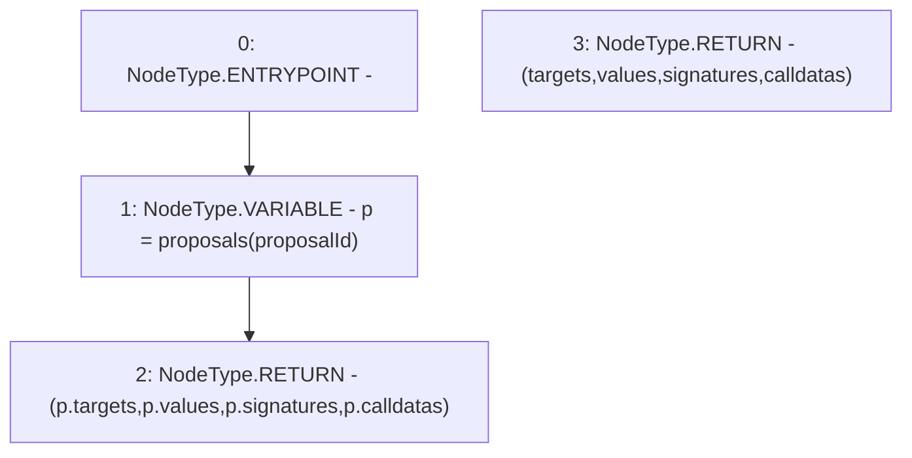

# Context: GovernorAlpha.getActions

**Contract:** `GovernorAlpha` (Inherits: None)
**Signature:** `getActions(uint256) returns (address[], uint256[], string[], bytes[])`
**Method Selector ID:** `0x328dd982`
**Visibility:** `public`
**Environment-Free:** `Yes`
**Modifiers:** None

### State Variables Interaction
- **Reads:** proposals
- **Writes:** None

### Environment & Verification Flags
- **Uses Foundry Cheatcodes:** No
- **Has Echidna Properties:** No

### Internal Calls Tree
- None

### External Calls / Value Transfers
- None

### Control Flow Graph (CFG)


### Source Mapping
Declared in: `certora-ac-datasets/detasets/web3bugs/dataset/web3bugs/52/contracts/governance/GovernorAlpha.sol` on lines **247** to **259**

```solidity
    function getActions(uint256 proposalId)
        public
        view
        returns (
            address[] memory targets,
            uint256[] memory values,
            string[] memory signatures,
            bytes[] memory calldatas
        )
    {
        Proposal storage p = proposals[proposalId];
        return (p.targets, p.values, p.signatures, p.calldatas);
    }

```
