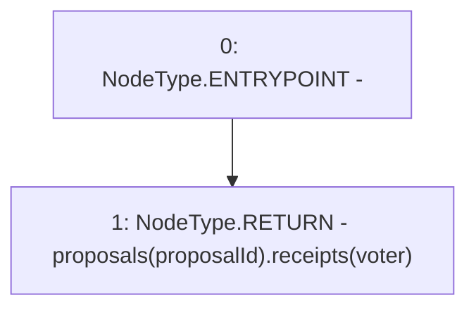

# Context: GovernorAlpha.getReceipt

**Contract:** `GovernorAlpha` (Inherits: None)
**Signature:** `getReceipt(uint256,address) returns (GovernorAlpha.Receipt)`
**Method Selector ID:** `0xe23a9a52`
**Visibility:** `public`
**Environment-Free:** `Yes`
**Modifiers:** None

### State Variables Interaction
- **Reads:** proposals
- **Writes:** None

### Environment & Verification Flags
- **Uses Foundry Cheatcodes:** No
- **Has Echidna Properties:** No

### Internal Calls Tree
- None

### External Calls / Value Transfers
- None

### Control Flow Graph (CFG)


### Source Mapping
Declared in: `certora-ac-datasets/detasets/web3bugs/dataset/web3bugs/52/contracts/governance/GovernorAlpha.sol` on lines **264** to **270**

```solidity
    function getReceipt(uint256 proposalId, address voter)
        public
        view
        returns (Receipt memory)
    {
        return proposals[proposalId].receipts[voter];
    }

```
