# Context: GovernorAlpha.propose

**Contract:** `GovernorAlpha` (Inherits: None)
**Signature:** `propose(address[],uint256[],string[],bytes[],string) returns (uint256)`
**Method Selector ID:** `0xda95691a`
**Visibility:** `public`
**Environment-Free:** `No (reads EVM state context)`
**Modifiers:** None

### State Variables Interaction
- **Reads:** feeAmount, feeReceiver, latestProposalIds, proposalCount, proposals, xVader
- **Writes:** latestProposalIds, proposalCount, proposals

### Assertion Checks & Business Requirements
- require/assert: `require(bool,string)(targets.length == values.length && targets.length == signatures.length && targets.length == calldatas.length,GovernorAlpha::propose: proposal function information arity mismatch)`
- require/assert: `require(bool,string)(targets.length != 0,GovernorAlpha::propose: must provide actions)`
- require/assert: `require(bool,string)(targets.length <= proposalMaxOperations(),GovernorAlpha::propose: too many actions)`
- require/assert: `require(bool,string)(proposersLatestProposalState != ProposalState.Active,GovernorAlpha::propose: one live proposal per proposer, found an already active proposal)`
- require/assert: `require(bool,string)(proposersLatestProposalState != ProposalState.Pending,GovernorAlpha::propose: one live proposal per proposer, found an already pending proposal)`

### Environment & Verification Flags
- **Uses Foundry Cheatcodes:** No
- **Has Echidna Properties:** No

### Internal Calls Tree
- None

### External Calls / Value Transfers
- `IXVader.TMP_52(bool) = HIGH_LEVEL_CALL, dest:xVader(IXVader), function:transferFrom, arguments:['msg.sender', 'feeReceiver', 'feeAmount']  `

### Control Flow Graph (CFG)

```mermaid
flowchart TD
    Node_0["0: NodeType.ENTRYPOINT - "]
    Node_0 --> Node_1
    Node_1["1: NodeType.EXPRESSION - require(bool,string)(targets.length == values.length && targets.length == signatures.length && targets.length == calldatas.length,GovernorAlpha::propose: proposal function information arity mismatch)"]
    Node_1 --> Node_2
    Node_2["2: NodeType.EXPRESSION - require(bool,string)(targets.length != 0,GovernorAlpha::propose: must provide actions)"]
    Node_2 --> Node_3
    Node_3["3: NodeType.EXPRESSION - require(bool,string)(targets.length <= proposalMaxOperations(),GovernorAlpha::propose: too many actions)"]
    Node_3 --> Node_4
    Node_4["4: NodeType.EXPRESSION - xVader.transferFrom(msg.sender,feeReceiver,feeAmount)"]
    Node_4 --> Node_5
    Node_5["5: NodeType.VARIABLE - latestProposalId = latestProposalIds(msg.sender)"]
    Node_5 --> Node_6
    Node_6["6: NodeType.IF - latestProposalId != 0"]
    Node_6 --> Node_7
    Node_6 --> Node_10
    Node_7["7: NodeType.VARIABLE - proposersLatestProposalState = state(latestProposalId)"]
    Node_7 --> Node_8
    Node_8["8: NodeType.EXPRESSION - require(bool,string)(proposersLatestProposalState != ProposalState.Active,GovernorAlpha::propose: one live proposal per proposer, found an already active proposal)"]
    Node_8 --> Node_9
    Node_9["9: NodeType.EXPRESSION - require(bool,string)(proposersLatestProposalState != ProposalState.Pending,GovernorAlpha::propose: one live proposal per proposer, found an already pending proposal)"]
    Node_9 --> Node_10
    Node_10["10: NodeType.ENDIF - "]
    Node_10 --> Node_11
    Node_11["11: NodeType.VARIABLE - startBlock = block.number + votingDelay()"]
    Node_11 --> Node_12
    Node_12["12: NodeType.VARIABLE - endBlock = startBlock + votingPeriod()"]
    Node_12 --> Node_13
    Node_13["13: NodeType.EXPRESSION - proposalId = ++ proposalCount"]
    Node_13 --> Node_14
    Node_14["14: NodeType.VARIABLE - newProposal = proposals(proposalId)"]
    Node_14 --> Node_15
    Node_15["15: NodeType.EXPRESSION - newProposal.id = proposalId"]
    Node_15 --> Node_16
    Node_16["16: NodeType.EXPRESSION - newProposal.proposer = msg.sender"]
    Node_16 --> Node_17
    Node_17["17: NodeType.EXPRESSION - newProposal.targets = targets"]
    Node_17 --> Node_18
    Node_18["18: NodeType.EXPRESSION - newProposal.values = values"]
    Node_18 --> Node_19
    Node_19["19: NodeType.EXPRESSION - newProposal.signatures = signatures"]
    Node_19 --> Node_20
    Node_20["20: NodeType.EXPRESSION - newProposal.calldatas = calldatas"]
    Node_20 --> Node_21
    Node_21["21: NodeType.EXPRESSION - newProposal.startBlock = startBlock"]
    Node_21 --> Node_22
    Node_22["22: NodeType.EXPRESSION - newProposal.endBlock = endBlock"]
    Node_22 --> Node_23
    Node_23["23: NodeType.EXPRESSION - latestProposalIds(msg.sender) = proposalId"]
    Node_23 --> Node_24
    Node_24["24: NodeType.EXPRESSION - ProposalCreated(proposalId,msg.sender,targets,values,signatures,calldatas,startBlock,endBlock,description)"]
    Node_24 --> Node_25
    Node_25["25: NodeType.RETURN - proposalId"]
```


### Source Mapping
Declared in: `certora-ac-datasets/detasets/web3bugs/dataset/web3bugs/52/contracts/governance/GovernorAlpha.sol` on lines **351** to **417**

```solidity
    function propose(
        address[] memory targets,
        uint256[] memory values,
        string[] memory signatures,
        bytes[] memory calldatas,
        string memory description
    ) public returns (uint256 proposalId) {
        require(
            targets.length == values.length &&
                targets.length == signatures.length &&
                targets.length == calldatas.length,
            "GovernorAlpha::propose: proposal function information arity mismatch"
        );
        require(
            targets.length != 0,
            "GovernorAlpha::propose: must provide actions"
        );
        require(
            targets.length <= proposalMaxOperations(),
            "GovernorAlpha::propose: too many actions"
        );

        xVader.transferFrom(msg.sender, feeReceiver, feeAmount);

        uint256 latestProposalId = latestProposalIds[msg.sender];
        if (latestProposalId != 0) {
            ProposalState proposersLatestProposalState = state(
                latestProposalId
            );
            require(
                proposersLatestProposalState != ProposalState.Active,
                "GovernorAlpha::propose: one live proposal per proposer, found an already active proposal"
            );
            require(
                proposersLatestProposalState != ProposalState.Pending,
                "GovernorAlpha::propose: one live proposal per proposer, found an already pending proposal"
            );
        }

        uint256 startBlock = block.number + votingDelay();
        uint256 endBlock = startBlock + votingPeriod();

        proposalId = ++proposalCount;
        Proposal storage newProposal = proposals[proposalId];
        newProposal.id = proposalId;
        newProposal.proposer = msg.sender;
        newProposal.targets = targets;
        newProposal.values = values;
        newProposal.signatures = signatures;
        newProposal.calldatas = calldatas;
        newProposal.startBlock = startBlock;
        newProposal.endBlock = endBlock;

        latestProposalIds[msg.sender] = proposalId;

        emit ProposalCreated(
            proposalId,
            msg.sender,
            targets,
            values,
            signatures,
            calldatas,
            startBlock,
            endBlock,
            description
        );
    }

```
