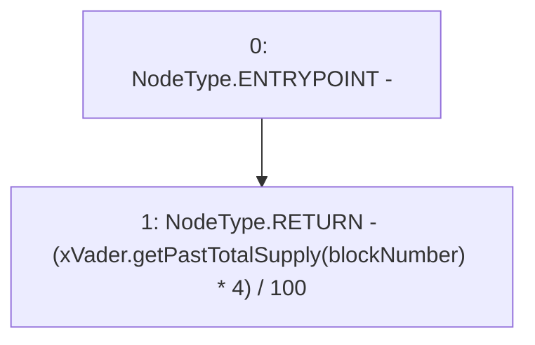

# Context: GovernorAlpha.quorumVotes

**Contract:** `GovernorAlpha` (Inherits: None)
**Signature:** `quorumVotes(uint256) returns (uint256)`
**Method Selector ID:** `0x0f7b1f08`
**Visibility:** `public`
**Environment-Free:** `Yes`
**Modifiers:** None

### State Variables Interaction
- **Reads:** xVader
- **Writes:** None

### Environment & Verification Flags
- **Uses Foundry Cheatcodes:** No
- **Has Echidna Properties:** No

### Internal Calls Tree
- None

### External Calls / Value Transfers
- `IXVader.TMP_16(uint256) = HIGH_LEVEL_CALL, dest:xVader(IXVader), function:getPastTotalSupply, arguments:['blockNumber']  `

### Control Flow Graph (CFG)


### Source Mapping
Declared in: `certora-ac-datasets/detasets/web3bugs/dataset/web3bugs/52/contracts/governance/GovernorAlpha.sol` on lines **225** to **227**

```solidity
    function quorumVotes(uint256 blockNumber) public view returns (uint256) {
        return (xVader.getPastTotalSupply(blockNumber) * 4) / 100; // 4% of xVader's supply at the time of proposal creation.
    }

```
