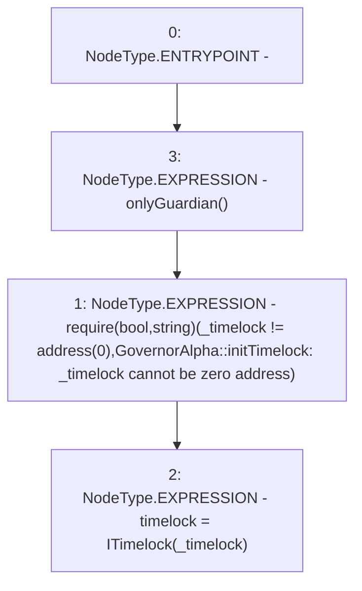

# Context: GovernorAlpha.setTimelock

**Contract:** `GovernorAlpha` (Inherits: None)
**Signature:** `setTimelock(address)`
**Method Selector ID:** `0xbdacb303`
**Visibility:** `external`
**Environment-Free:** `No (reads EVM state context)`
**Modifiers:**
- `onlyGuardian`
  ```solidity
  modifier onlyGuardian() {
          _onlyGuardian();
          _;
      }
  ```

### State Variables Interaction
- **Reads:** None
- **Writes:** timelock

### Assertion Checks & Business Requirements
- require/assert: `require(bool,string)(_timelock != address(0),GovernorAlpha::initTimelock: _timelock cannot be zero address)`

### Environment & Verification Flags
- **Uses Foundry Cheatcodes:** No
- **Has Echidna Properties:** No

### Internal Calls Tree
- None

### External Calls / Value Transfers
- None

### Control Flow Graph (CFG)


### Source Mapping
Declared in: `certora-ac-datasets/detasets/web3bugs/dataset/web3bugs/52/contracts/governance/GovernorAlpha.sol` on lines **332** to **338**

```solidity
    function setTimelock(address _timelock) external onlyGuardian {
        require(
            _timelock != address(0),
            "GovernorAlpha::initTimelock: _timelock cannot be zero address"
        );
        timelock = ITimelock(_timelock);
    }

```
